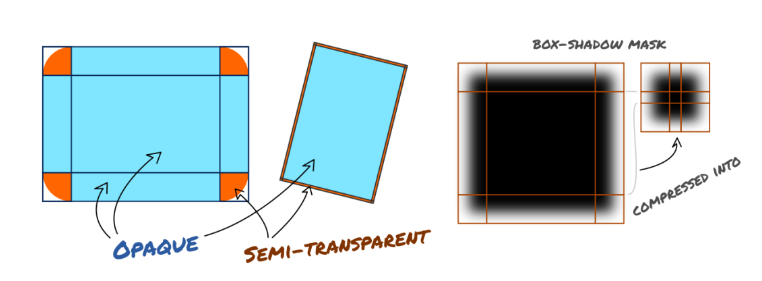
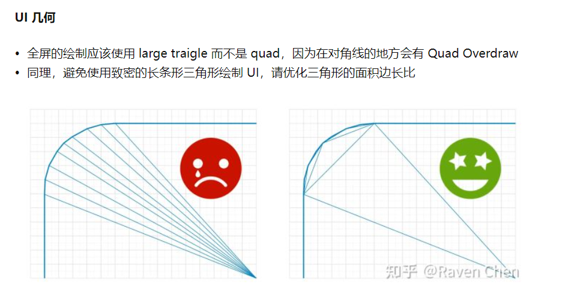
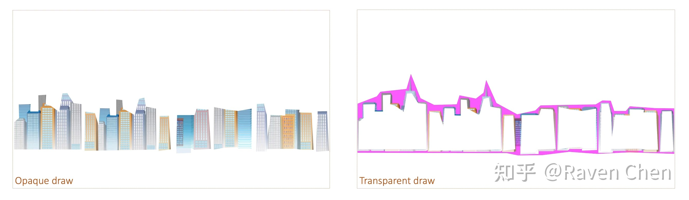
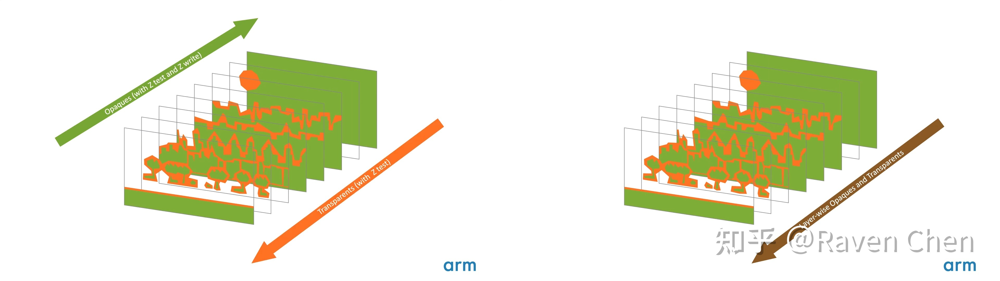
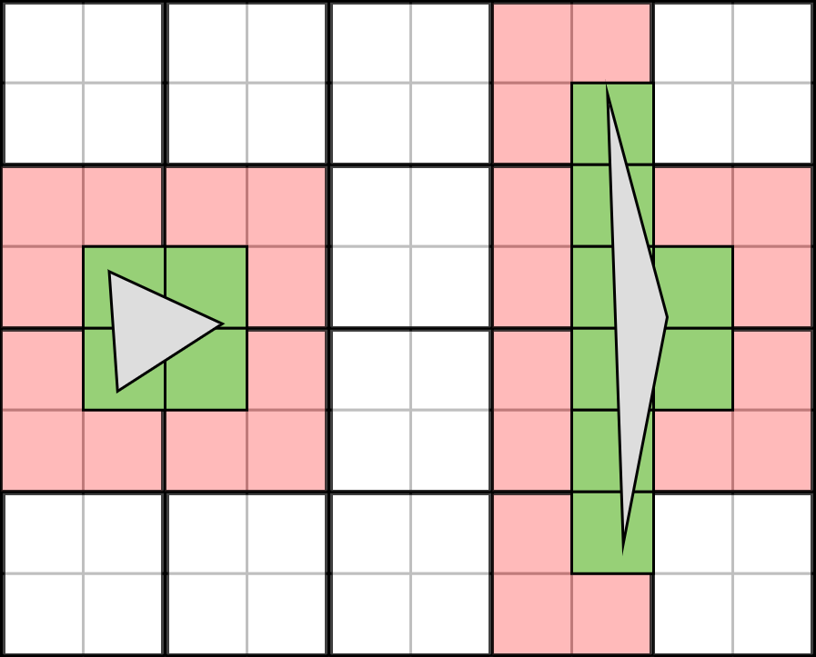
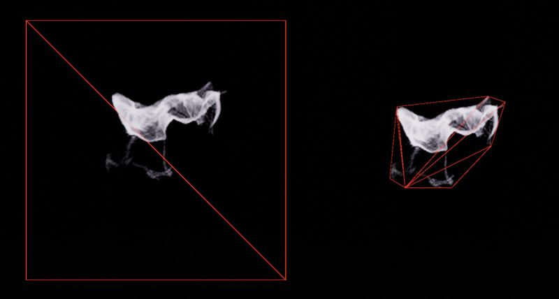

- [2D渲染](#2d渲染)
  - [1、参考框架](#1参考框架)
  - [2、批量 处理](#2批量-处理)
    - [2.1、WebRender](#21webrender)
    - [2.2、Arm Mali GPU 教程系列 第2辑](#22arm-mali-gpu-教程系列-第2辑)
    - [2.3、GPU Performance for Game Artists](#23gpu-performance-for-game-artists)

# 2D渲染

## 1、参考框架

|框架链接||
|--|--|
|[WebRender](https://github.com/servo/webrender)||
|[PathFinder](https://github.com/servo/pathfinder)||
|[piet-gpu](https://github.com/linebender/piet-gpu)||
|[Skia](https://github.com/google/skia)||

## 2、批量 处理

### 2.1、[WebRender](https://mozillagfx.wordpress.com/2019/01/03/webrender-primitive-segmentation/)

这篇文章，说明，可以用 CPU 将 透明 和 不透明 分开，先集中渲染 不透明 的 部分；

### 2.2、[Arm Mali GPU 教程系列 第2辑](https://zhuanlan.zhihu.com/p/402312343)

这篇文章进一步说明，即使是图片，还是可以这么做。

### 2.3、[GPU Performance for Game Artists](http://fragmentbuffer.com/gpu-performance-for-game-artists/)

对粒子系统的图片，可以用 一系列 三角形 批分；减少无效像素的运行

