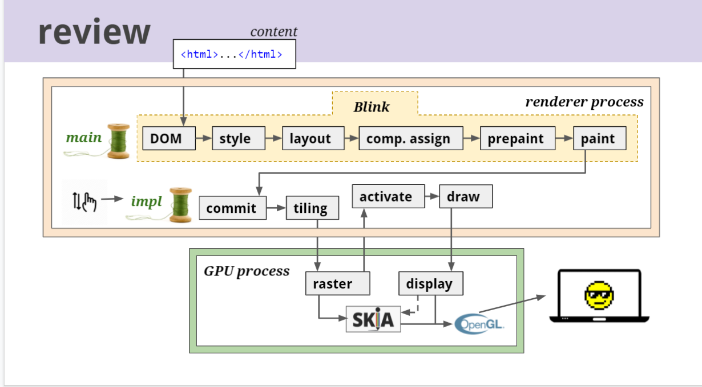

- [Chrome 渲染架构](#chrome-渲染架构)
	- [1. 入门-参考](#1-入门-参考)
	- [2. Blink：Render Pipeline](#2-blinkrender-pipeline)
	- [3. 进阶--参考](#3-进阶--参考)

# Chrome 渲染架构

## 1. 入门-参考

* [翻译：Inside LookAt Modern Web Browser](https://zhuanlan.zhihu.com/p/102149546)
* [PPT：Life of A Pixel](https://docs.google.com/presentation/d/1boPxbgNrTU0ddsc144rcXayGA_WF53k96imRH8Mp34Y/edit#slide=id.ga884fe665f_64_80)
* [翻译：How Blink Works](https://zhuanlan.zhihu.com/p/52918538)
* [翻译：How CC Works](https://zhuanlan.zhihu.com/p/54601110)
* **How Viz Works**
	+ [介绍](https://zhuanlan.zhihu.com/p/61416139)
	+ [合成器架构](https://zhuanlan.zhihu.com/p/62076419)
	+ [SkiaRenderer & SkiaOutputSurface](https://zhuanlan.zhihu.com/p/73168888)

## 2. Blink：Render Pipeline

+ Blink 主线程，运行js的那个
	* DOM：Html --> DOM Tree；
	* Style：CSS 计算 每个Dom节点的 Computed-Style；
	* Layout：计算每个Node的Layout --> Layout Tree；
	* `TODO：` comp.assign
	* `TODO：` prepaint
	* Paint: 根据Layout Tree 和 z-index --> Diplay List (确定 渲染顺序)；
+ Blink 合成器线程，后缀 Impl 的类，都会在这个线程运行
	* Commit: 提交给合成器线程；
	* Tiling --> 根据某些规则，生成 Layer Tree（比如有will-change的节点）；
	* GPU进程--Raster --> 每个Tiling分别送到Raster线程，进行光栅化 --> GPU Texture；
	* Activate --> 确定当前有用的Layer；
	* Draw --> 发给GPU进程；
	* GPU进程--Display --> 用 Skia 或 GL 合成最终图像；

## 3. 进阶--参考

* [Chrome 的 流水线解析 && 动画性能](https://zhuanlan.zhihu.com/p/30534023)
* 光栅化
	+ [渲染流水线中的光栅化（一）](https://zhuanlan.zhihu.com/p/78758247)
	+ [渲染流水线中的光栅化（二）](https://zhuanlan.zhihu.com/p/81974121)
	+ [混合光栅化](https://zhuanlan.zhihu.com/p/165212949)
* Android 中 合成
	+ [TextureView 的 血与泪 （一）](https://zhuanlan.zhihu.com/p/147322501)
	+ [TextureView 的 血与泪 （二）](https://zhuanlan.zhihu.com/p/363426469)
* [Chrome: 属性树](https://chromium.googlesource.com/chromium/src/+/refs/heads/main/third_party/blink/renderer/core/paint/README.md)