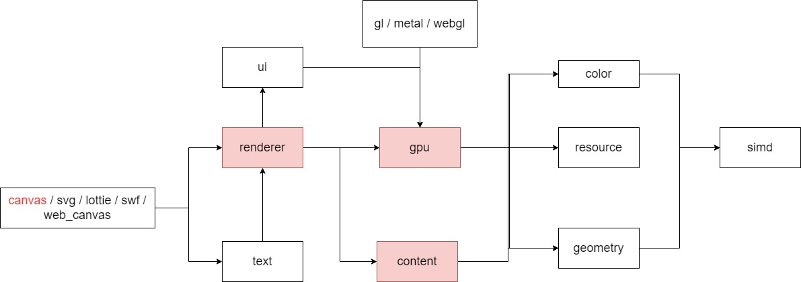

- [Servo:Pathfinder](#servopathfinder)
  - [0. 参考](#0-参考)
  - [1. 概述](#1-概述)
    - [1.1. enum GLVersion](#11-enum-glversion)
    - [1.2. enum RendererLevel](#12-enum-rendererlevel)
    - [1.3. 性能测试](#13-性能测试)
      - [1.1. 分辨率: 1920 * 1080](#11-分辨率-1920--1080)
      - [1.2. 分辨率: 13 * 13](#12-分辨率-13--13)
  - [2. 设置深度值](#2-设置深度值)
  - [3. Program](#3-program)
    - [3.1. "d3d9/fill" FillProgramD3D9](#31-d3d9fill-fillprogramd3d9)
    - [3.2. "d3d9/tile" TileProgramD3D9](#32-d3d9tile-tileprogramd3d9)
    - [3.3. "d3d9/tile_clip_copy" ClipTileCopyProgramD3D9](#33-d3d9tile_clip_copy-cliptilecopyprogramd3d9)
    - [3.4. "d3d9/tile_clip_combine" ClipTileCombineProgramD3D9](#34-d3d9tile_clip_combine-cliptilecombineprogramd3d9)
    - [3.5. "d3d9/tile_copy" CopyTileProgram](#35-d3d9tile_copy-copytileprogram)
  - [4. Renderer::render_command()](#4-rendererrender_command)
  - [5. 数据结构](#5-数据结构)
    - [5.1. struct Fill](#51-struct-fill)
    - [5.2. DrawTileBatchD3D9](#52-drawtilebatchd3d9)
    - [5.3. struct TileObjectPrimitive](#53-struct-tileobjectprimitive)
    - [5.4. struct Clip](#54-struct-clip)
    - [5.5. struct TileBatchTexture](#55-struct-tilebatchtexture)
  - [6. 字体](#6-字体)
  - [7. svg](#7-svg)

# Servo:Pathfinder

+ 官方: https://github.com/servo/pathfinder
+ fork: https://github.com/GaiaWorld/pathfinder
  - 将 usvg 从 0.9 --> 0.24
  - 因在 Android端 SIMD 构建有问题，暂时 在 pi_svg库 关闭 simd-feature

## 0. 参考

+ Pathfinder
  - [Pathfinder 算法概述](https://nical.github.io/posts/a-look-at-pathfinder.html)
  - [Pathfinder 架构](https://github.com/servo/pathfinder/blob/master/doc/architecture.md)
  - [矢量图 / 字体 相关方案](https://github.com/servo/pathfinder/wiki/Related-approaches)
+ piet-gpu
  - [piet-gpu](https://github.com/linebender/piet-gpu)
  - [Modern GPU 2D Rendering](https://raphlinus.github.io/rust/graphics/gpu/2019/05/08/modern-2d.html)
+ lyon
  - [lyon 相关方案](https://github.com/nical/lyon/wiki/Related-projects#tiling-approaches)
+ Glug
  - [GPU Font Rendering: 环绕数 介绍](http://terathon.com/i3d2018_lengyel.pdf)
+ 论文  
  - [NV Path](https://developer.download.nvidia.cn/devzone/devcenter/gamegraphics/files/opengl/gpupathrender.pdf)
  - [Resolution Independent Curve Rendering using Programmable Graphics Hardware](https://www.microsoft.com/en-us/research/wp-content/uploads/2005/01/p1000-loop.pdf)
  - [Random-Access Rendering of General Vector Graphics](https://hhoppe.com/ravg.pdf)

## 1. 概述

矢量图 / Canvas2D子集 / Path 渲染器

+ SVG 支持
+ 纯 Rust 实现
+ 两套 GPU 渲染方案
+ 抗锯齿
+ 字体渲染：亚像素抗锯齿

### 1.1. enum GLVersion

目前 内部-实现 的 渲染后端 API，支持: GL / GLES / Metal / WebGL2

+ GL3, GL 3.3+
+ GLES3, GLES 3.0+
+ GL4, GL 4.3+

### 1.2. enum RendererLevel

计算 和 渲染 流程

+ D3D9: D3D-9 / GL 3.0 / WebGL 2.0 
    - CPU: Bin 用 simd + rayon 并行计算 16*16 Tile
    - GPU: fill / composite
+ D3D11: D3D-11 / GL 4.3 / Metal / Vulkan / WebGPU
    - GPU: Bin 用 计算着色器 计算 16*16 Tile
    - GPU: fill / composite

### 1.3. 性能测试

+ 笔记本: Win-11; 64-bit
  - CPU: AMD Ryzen 7 5800H Radeon Graphics
  - GPU: NVIDIA GeForce RTX 3050 Ti Laptop GPU
+ 测试文件: Ghostscript_Tiger.svg

#### 1.1. 分辨率: 1920 * 1080

|渲染方案|simd|no-simd|
|--|--|--|
|GL4-D3D9|420 fps；CPU 34%，GPU 31%|350 fps；CPU 40%，GPU 30%|
|GL4-D3D11|478 fps；CPU 12%，GPU 40%|460 fps；CPU 12%，GPU 40%|

#### 1.2. 分辨率: 13 * 13

+ D3D-9 方案，显存 40M 左右（包括 example本身的 窗口 + 渲染目标）
+ D3D-11 用 `计算着色器` 时，如果 过多的 path 全部分配到 同一个tile，显存会因过大而崩溃；（大于 2G）

|渲染方案|simd|no-simd|
|--|--|--|
|GL4-D3D9|570 fps；CPU 15%，GPU 15-26%|540 fps；CPU 20%，GPU 30%|
|GL4-D3D11|因显存过大而崩溃|因显存过大而崩溃|

## 2. 设置深度值

D3D9 方案中

+ 文件: renderer\src\builder.rs
+ 方法: build_tile_batches_for_draw_path_display_item(
+ 调用点: z_buffer_data: DenseTileMap::from_builder(|_| 0, tile_bounds)

## 3. Program

### 3.1. "d3d9/fill" FillProgramD3D9 

+ attribute
    - uvec2 aTessCoord;
    - uvec4 aLineSegment;
    - int aTileIndex;
+ uniform
    - sampler2D uAreaLUT;
    - vec2 uFramebufferSize;
    - vec2 uTileSize;

### 3.2. "d3d9/tile" TileProgramD3D9 

+ attribute
    - ivec2 aTileOffset;
    - ivec2 aTileOrigin;
    - uvec4 aMaskTexCoord0;
    - ivec2 aCtrlBackdrop;
    - int aPathIndex;
    - int aColor;
+ uniform
    - mat4 uTransform;
    - vec2 uTileSize;
    - sampler2D uTextureMetadata;
    - ivec2 uTextureMetadataSize;
    - sampler2D uZBuffer;
    - ivec2 uZBufferSize;
    - sampler2D uColorTexture0;
    - sampler2D uMaskTexture0;
    - sampler2D uDestTexture;
    - sampler2D uGammaLUT;
    - vec2 uColorTextureSize0;
    - vec2 uMaskTextureSize0;
    - vec2 uFramebufferSize;

### 3.3. "d3d9/tile_clip_copy" ClipTileCopyProgramD3D9

+ attribute
    - aTileOffset;
    - aTileIndex;
+ uniform
    - sampler2D uSrc;
    - vec2 uFramebufferSize;

### 3.4. "d3d9/tile_clip_combine" ClipTileCombineProgramD3D9

+ attribute
    - ivec2 aTileOffset;
    - int aDestTileIndex;
    - int aDestBackdrop;
    - int aSrcTileIndex;
    - int aSrcBackdrop;
+ uniform
    - sampler2D uSrc;
    - vec2 uFramebufferSize;

### 3.5. "d3d9/tile_copy" CopyTileProgram

+ attribute
    - ivec2 aTilePosition;
+ uniform
    - vec2 uTileSize
    - sampler2D uSrc;
    - mat4 uTransform;
    - vec2 uFramebufferSize;

## 4. Renderer::render_command()

+ RenderCommand::Start
+ RenderCommand::UploadTextureMetadata(Vec<TextureMetadataEntry>)
+ RenderCommand::AddFillsD3D9(Vec<Fill>)
  - RendererD3D9::add_fills()
  - 积累到 65536 后，就 RendererD3D9::draw_buffered_fills
+ RenderCommand::FlushFillsD3D9
    - RendererD3D9::draw_buffered_fills();
      * RendererD3D9::draw_fills() --> draw_elements_instanced()
+ RenderCommand::DrawTilesD3D9(DrawTileBatchD3D9)
    - RendererD3D9::upload_and_draw_tiles();
      * RendererD3D9::clip_tiles() --> draw_elements_instanced()
      * upload_tiles()
      * upload_z_buffer()
      * draw_tiles() --> draw_elements_instanced()
+ RenderCommand::Finish

## 5. 数据结构

### 5.1. struct Fill

+ line_segment: LineSegmentU16(from_x, from_y, to_x, to_y)
+ link: u32

### 5.2. DrawTileBatchD3D9

+ tiles: Vec<TileObjectPrimitive>,
+ clips: Vec<Clip>,
+ z_buffer_data: DenseTileMap<i32>,
+ color_texture: Option<TileBatchTexture>,
+ filter: Filter,
+ blend_mode: BlendMode,

### 5.3. struct TileObjectPrimitive

+ tile_x: i16,
+ tile_y: i16,
+ alpha_tile_id: AlphaTileId,
+ path_id: PathId,
+ color: u16,
+ ctrl: u8,
+ backdrop: i8,

### 5.4. struct Clip

+ dest_tile_id: AlphaTileId,
+ dest_backdrop: i32,
+ src_tile_id: AlphaTileId,
+ src_backdrop: i32,

### 5.5. struct TileBatchTexture

+ page: TexturePageId,
+ sampling_flags: TextureSamplingFlags,
+ composite_op: PaintCompositeOp,

## 6. 字体

+ 用 font-kit 将 轮廓的 二次，三次 贝塞尔曲线 录到 path
+ 然后用 canvas 2d api 渲染

## 7. svg

+ 官方 用 usvg 0.9，支持 属性 有限
+ 目前fork一份到 GaiaWorld，升级到 usvg 0.24