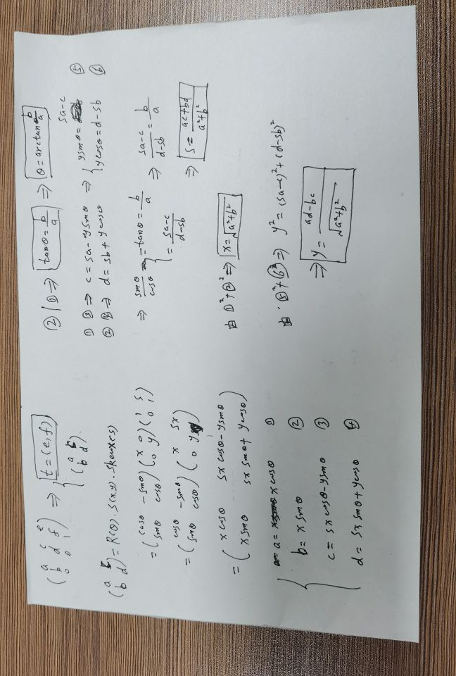

- [CSS Transform 动画插值](#css-transform-动画插值)
  - [1、2D 变换 插值](#12d-变换-插值)
    - [1.1、操作概述](#11操作概述)
    - [1.2、矩阵 QR分解](#12矩阵-qr分解)
    - [1.3、矩阵 插值](#13矩阵-插值)
    - [1.4、变换序列 的 插值](#14变换序列-的-插值)
      - [1.4.1、情况1：操作序列 全相同](#141情况1操作序列-全相同)
      - [1.4.2、情况2：前面的 操作序列 相同，但是 有一个短](#142情况2前面的-操作序列-相同但是-有一个短)
      - [1.4.3、情况3：前面的 操作序列 不尽相同](#143情况3前面的-操作序列-不尽相同)
    - [1.5、不可逆](#15不可逆)
    - [1.6、序列插入 和 变为矩阵插入的 差异](#16序列插入-和-变为矩阵插入的-差异)
  - [2、3D 变换 插值](#23d-变换-插值)
    - [2.1、矩阵 分解](#21矩阵-分解)
    - [2.1、4 * 4 矩阵 分解为：P * T * R * S * K](#214--4-矩阵-分解为p--t--r--s--k)
    - [2.2、插值](#22插值)
    - [2.3、将 P * T * R * S * K 变回 矩阵，用 线性代数 即可；](#23将-p--t--r--s--k-变回-矩阵用-线性代数-即可)

# CSS Transform 动画插值

## 1、[2D 变换 插值](https://drafts.csswg.org/css-transforms/#transform-function-lists)

### 1.1、操作概述

+ 原点：默认在 物体 中心点，可以改变
+ 右结合
  - 比如 R(30°) T(tx, ty)；固定坐标系下，物体 先做 T，在做 R

基本操作：

+ R(a°) 旋转 a度，a>0逆时针；否则顺时针；
+ T(tx, ty) 平移 (x, y)
+ S(x, y) 缩放 (x, y)
+ Skew(s°, t°) 斜切变换，变换值分别为 tan(s°), tan(t°)
+ matrix(a, b, c, d, e, f) 3*3的矩阵，从上往下，每一行依次为：(a, c, e), (b, d, f), (0, 0, 1)

### 1.2、矩阵 QR分解

+ 输入：matrix(a, b, c, d, e, f) 
  - 条件：ad - bc 不 为 0，
+ 输出：6 个 互相独立的数字 (tx, ty, r, x, y, s)
  - 通过 QR 变换 分解为 = T(tx, ty) R(r rad) S(x, y) Skew(z°, 0) [ 令 s = Math.tan(z°)] 其中：
    * tx = e,
    * ty = f,
    * r = Math.atan2(b, a)
    * x = Math.sqrt(a * a + b * b)
    * y = (a * d - b * c) / x
    * s = (a * c + b * d) / (x * x)

推导见下图：

### 1.3、矩阵 插值

+ 输入：
  - from = M
  -   to = M
+ 输出：
  - 插值后的矩阵 matrix(a, b, c, d, e, f)

操作：

+ 1、分解
  - 将 from 的 M 通过 2.2 得到 6个数字 
  - 将   to 的 M 通过 2.2 得到 6个数字 
+ 2、结果：
  - from = tx, ty, r, x, y, s
  -   to = tx, ty, r, x, y, s
+ 3、逐个数字 依次 插值
  - r = tx, ty, r, x, y, s
+ 4、将 r 还原为 矩阵 matrix(a, b, c, d, e, f)
  - a = x * cos(r)
  - b = x * sin(r)
  - c = s * a - y * sin(r)
  - d = s * b + y * cos(r)
  - e = tx
  - f = ty

### 1.4、变换序列 的 插值

from, to 两个关键帧 序列 如下：

+ from = F1, F2, F3, ...
+ to = T1, T2, T3, ...

#### 1.4.1、情况1：操作序列 全相同

+ from = R S T R S
+ to   = R S T R S

则 每个 操作独立 插值，得到

+ r = R S T R S，作用到 动画中即可；

#### 1.4.2、情况2：前面的 操作序列 相同，但是 有一个短

+ from = R S T R S
+ to   = R S T R

则 to 最后一个补上 一个恒等操作，就变成 `情况1`

+ S 的 恒等操作 S(1, 1)
+ T 的 恒等操作 T(0, 0)
+ R 的 恒等操作 R(0°)
+ Skew 的 恒等操作 Skew(0°, 0°)
+ matrix 的 恒等操作 matrix(1, 0, 0, 1, 0, 0)

#### 1.4.3、情况3：前面的 操作序列 不尽相同

+ from = R S T R S
+ to   = R S R T

前两个操作相同，第三个操作开始不同：

注：对 R，S，T，Skew 如何 变矩阵，[请参考这里](https://drafts.csswg.org/css-transforms/#mathematical-description)

+ 将 from 的 最后三个 操作相乘，变成 矩阵 T R S = M
+ 将 to 的 最后两个 操作相乘，变成 矩阵 R T = M

结果 回到 `情况1`，如下：

+ from = R S M
+ to   = R S M

### 1.5、不可逆

+ 当 变换成 2.4 的 `情况1` 之后，对于 matrix(a, b, c, d, e, f)，如 a * d - b * c = 0，则 不 播 放 动 画
+ 插值后的操作序列，以下条件成立，则 这一帧 不 渲 染 物体：
    - Scale(x, y) 的 x = 0 或者 y = 0
    - matrix(a, b, c, d, e, f) 的 a * d - b * c = 0

### 1.6、序列插入 和 变为矩阵插入的 差异

下面情况下，效果不对等：

+ 2.4 的 情况1 下，对于 Scale(0, 0)，可以插值；变矩阵后矩阵不可分解，就无法做动画插值；
+ 2.4 的 情况1 下，对于 Rotate(1000°)，对Rotate插值，能转好几圈；但变成矩阵后，就 只能转 0-360°

## 2、[3D 变换 插值](https://drafts.csswg.org/css-transforms-2/#funcdef-translate3d)

### 2.1、矩阵 分解

### 2.1、4 * 4 矩阵 分解为：P * T * R * S * K

+ Translation = (tx, ty, tz)
+ Scale = (x, y, z)
+ sKew = (sx, sy, sz)
+ Perspective = (px, py, pz, pw)
+ R(quaternion) = (qx, qy, qz, qw)

### 2.2、插值

+ 其他按 数字 独立插值 即可
+ quaternion 四元数，用 线性代数库 的 slerp 插值 得到 结果
+ 得到 插值后的 P * T * R * S * K

### 2.3、将 P * T * R * S * K 变回 矩阵，用 线性代数 即可；

