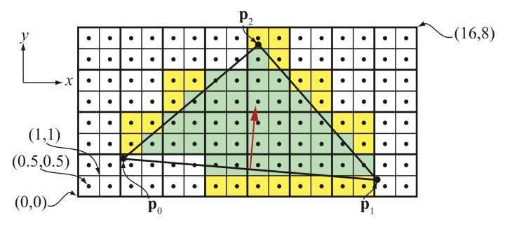

# GPU 架构常识

+ 当一个drawcall 到gpu后，gpu的图元 派发器 会拆分成多个三角形，装到wrap批量处理，比如 32个顶点一组。
+ 顶点之间 互不干扰 拿不到对方的数据。
+ 到了fs 因为需要计算mipmap，本来就要知道相邻像素的varying信息。所以gpu组织上就2*2个像素一组 批量执行 ps
+ ps能取到相邻像素的相关数据。用dfdx dfdy函数就可以。
+ vs不灵活 所以出现了gs 但gs性能不好 现在由cs代替了。同理，stream output 和 变换反馈 也被 代替了
+ 会有更通用的 mesh shader、task shader 代替 vs、ts曲面细分阶段。

## 参考

+ [深入GPU硬件架构及运行机制](https://zhuanlan.zhihu.com/p/357112957)
+ [Vertex Shader中怎么获取临近顶点的属性值？](https://www.zhihu.com/question/516695017/answer/2356701024?utm_campaign=&utm_medium=social&utm_oi=40932619583488&utm_psn=1540417153802473473&utm_source=qq)