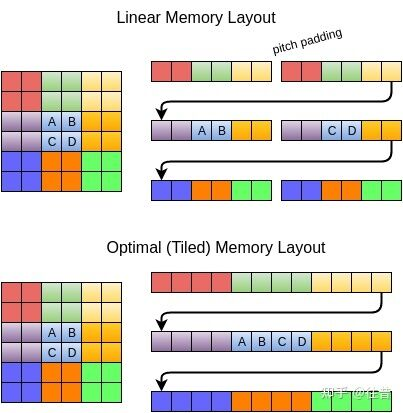

# 纹理采样

## 布局

如果像素采样时候不是正好命中 abcd这四个点 那么 texture2d 就会出现cache-miss 重新再读一次纹理。为了性能，要用mipmap 这样才能最可能的逐纹素过度过去。

倒数第二张图 是ps的批量处理图 黄色的 2*2块一起 所以dfdx dfdy取到的 同一个quad内的值 是相同的 ，因为他取不到隔壁 wrap的值。不过现代gpu对wrap可以操作的像素个数增加了。

## 参考

+ [图形学中Buffer和Texture是如何组织数据的？](https://www.zhihu.com/question/535575005/answer/2569607573)