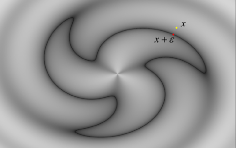

# 用梯度法 近似 曲线的 SDF

## 0. 参考

+ [点到函数的距离估计](https://zhuanlan.zhihu.com/p/108619113)
+ [用 梯度法 估算 点到曲线 距离](https://iquilezles.org/articles/distance/)
+ [用 梯度法 估算 椭圆 的 sdf](https://iquilezles.org/articles/ellipsoids/)
+ [椭圆 sdf 的精确求解（四次方程的公式解 和 牛顿法）](https://iquilezles.org/articles/ellipsedist/)

## 1. 数学 推导

$z = f(\vec{x})$ 是 标量场

曲线 有 $f(\vec{x})=0$ 定义

如果 点 $\vec{x}$ 使得 $f(\vec{x} + \vec{\epsilon}) = 0$, 则 $||\vec{\epsilon}||$ 就是 点 $\vec{x}$ 的 sdf

由 [全微分公式](https://en.wikipedia.org/wiki/Total_derivative)，有

0 = $f(\vec{x} + \vec{\epsilon}) =f(\vec{x}) + \nabla f(\vec{x}) \cdot \vec{\epsilon} + o(||\vec{\epsilon}||)$

三角不等式 和 点积的柯西不等式, 得到 $||\vec{\epsilon}||$ 的 一个 下限

0 = $||f(\vec{x} + \vec{\epsilon})|| \ge ||f(\vec{x})|| - ||\nabla f(\vec{x}) \cdot \vec{\epsilon}|| \ge ||f(\vec{x})|| - ||\nabla f(\vec{x})|| \times ||\vec{\epsilon}||$

### 点 $\vec{x}$ 在 曲线 / 曲面 $f(\vec{x}) = 0$ 的 sdf 的 近似公式

注：上面用到 全微分，是 局部性质，所以 近似 只有在 f = 0 附近 的 点 比较精确，也就是 曲线 周围 比较精确；

$sdf(f, \vec{x}) \ge \frac{||f(\vec{x})||}{||\nabla f(\vec{x})||}$

## 2. 椭圆 sdf 估计

结论: 

+ 令 $k_1 = \sqrt{\frac{x^2}{a^2} + \frac{y^2}{b^2}}$
+ 令 $k_2 = ||(\frac{x}{a^2},\frac{y}{b^2})|| = \sqrt{\frac{x^2}{a^4} + \frac{y^2}{b^4}}$
+ sdf = $\frac{k_1 \times (k_1 - 1)}{k2}$

圆 $x^2 + y^2 = R^2$ 的 sdf 是 $s(x, y) = \sqrt{x^2 + y^2} - R$

根据 仿射变换，椭圆 $\frac{x^2}{a^2} + \frac{y^2}{b^2} = 1$ 的 曲线方程 是 $s(x, y) = \sqrt{\frac{x^2}{a^2} + \frac{y^2}{b^2}} - 1$

梯度 $\nabla{s} = \frac{(\frac{x}{a^2},\frac{y}{b^2})}{k_1}$

$sdf(x, y) \ge \frac{k_1 - 1}{||\nabla f(\vec{p})||} = \frac{k_1 - 1}{\frac{k_2}{k_1}} = \frac{k_1 \times (k_1 - 1)}{k2}$