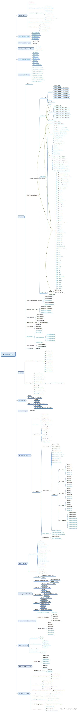

# [GLES 3 / WebGL 2](https://www.khronos.org/files/webgl20-reference-guide.pdf)

## Framebuffer Object

+ Renderbuffer
    - renderbufferStorageMultisample
+ Attach-Texture
    - framebufferTextureLayer
+ Invalidate Content
    - invalidateFramebuffer
    - invalidateSubFramebuffer

## Sync & Fence

+ fenceSync
+ deleteSync
+ clientWaitSync
+ waitSync

## Whole Framebuffer OP

+ drawBuffers
+ clearBuffer(ifv/ulv/fi)

## Shader

+ programBinary
+ programParameteri
+ getFragDataLocation
+ uniform*
    - (1/2/3/4)ui[v]
    - matrix(2/3/4)x(2/3/4)fv
+ 变换反馈
    - transformFeedbackVaryings
    - getTransformFeedbackVarying
+ UBO
    - uniformBlockBinding
    - getUniformBlockIndex
    - getActiveUniformBlockName
    - getActiveUniformBlckiv
    - getUniformIndices
    - getActiveUniformsiv

## Async Query

+ genQueries
+ deleteQueries
+ beginQuery
+ endQuery
+ getQueryiv
+ getQueryObjectuiv

## Transform Feedback

+ genTransformFeedbacks
+ deleteTransformFeedbacks
+ bindTransformFeedback
+ beginTransformFeedback
+ endTransformFeedback
+ pauseTransformFeedback
+ resumeTransformFeedback

## Read-Copy Pixel

+ readBuffer
+ blitFramebuffer

## Vertex Array Object

+ genVertexArrays
+ deleteVertexArrays
+ bindVertexArray

## Vertices

+ vertexAttrib*
    - i4(i/ui)[v]
+ 几何实例化
    - vertexAttribDivisor
    - drawArraysInstanced
    - drawElementsInstanced
+ drawRangeElements
+ enable/disable (GL_PRIMITIVE_RESTART_FIXED_INDEX)

## Buffer Oject

+ Bind Buffer
    - bindBufferBase
    - bindBufferRange
+ Map
    - mapBufferRange
    - unmapBuffer
    - flushMappedBufferRange
+ Copy
    - copyBufferSubData

## Texture Op

+ Sampler Object
    - genSamplers
    - deleteSamplers
    - bindSampler
+ 3D Texture
    - texImage3D
    - texSubImage3D
    - copyTexSubImage3D
    - compressedTexImage3D
    - compressedTexSubImage3D
+ Storage Image
    - texStorage2D
    - texStorage3D

## Texture Format

+ 3D target
    - GL_TEXTURE_3D
    - GL_TEXTURE_2D_ARRAY
+ type
    - BYTE
    - SHORT/USHORT
    - FLOAT/HALF_FLOAT
    - UINT_2_10_10_10_REV
    - UINT_24_8
    - UINT_10F_11F_11F_REV
    - UINT_5_9_9_9_REV
    - F32_UINT_24_8_REV
    - gles2
        * UBYTE
        * USHORT_5_6_5
        * USHORT_4_4_4_4
        * USHORT_5_5_5_1
+ format
    - RED / RED_INTEGER
    - RG / RG_INTEGER
    - RGB_INTEGER / RGBA_INTEGER
    - DEPTH_COMPONENT
    - DEPTH_STENCIL
    - gles2
        * ALPHA
        * RGB / RGBA
        * LUMINANCE / LUMINANCE_ALPHA
+ internalformat
    - gles2
        * ALPHA
        * RGB / RGBA
        * LUMINANCE / LUMINANCE_ALPHA
    - DEPTH_*
    - 

## GLES 2 -> 3 变化，非黑色代表 新添加

