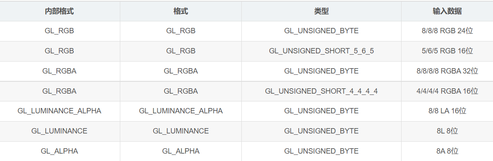
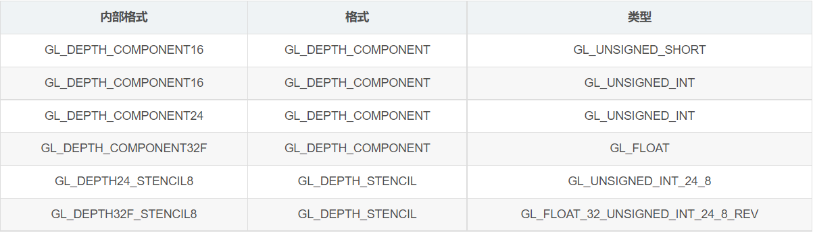
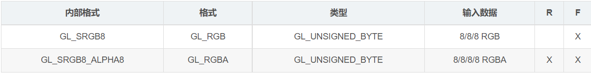
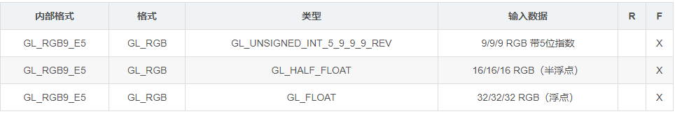
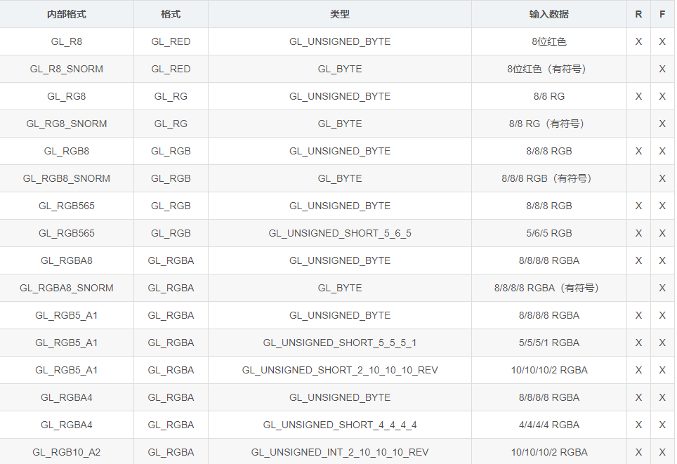
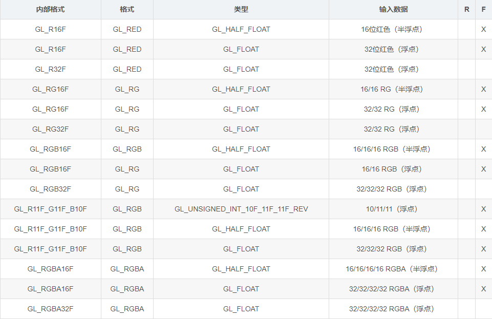
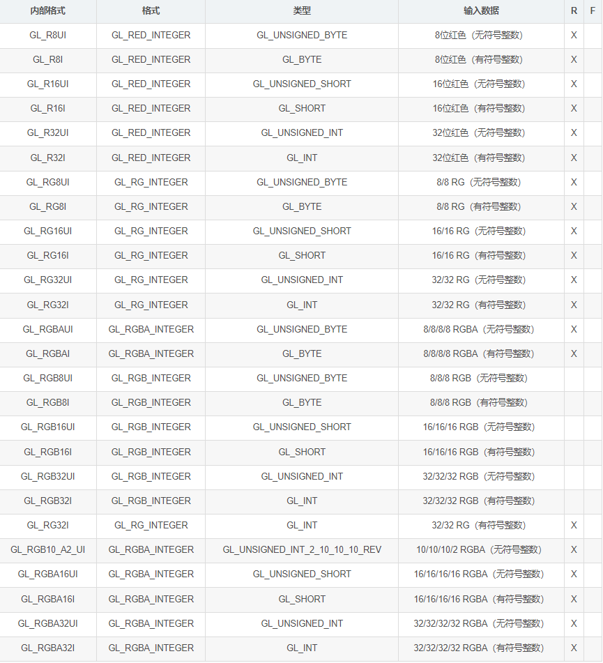

# [GLES 3.0 纹理格式](https://blog.csdn.net/afei__/article/details/96158388)

+ 深度纹理
+ sRGB纹理
+ 共享指数 纹理
+ 规范化 纹理
+ 浮点 纹理
+ 整数 纹理

## 表格 说明

+ R = 格式可渲染
+ F = 格式可过滤
+ X 表示支持

## 复习：glTexImage2D

``` cpp

/**
 * @param internalformat GPU 内部 存储 格式
 * @param format 输入pixels内容格式
 * @param type 输入pixels的数据类型
 */
void glTexImage2D(target, level, internalformat, w, h, border, format, type, void* pixels);

```

## 复习：GLES 2.0



## 深度 纹理 （格式 DEPTH 前缀）



## sRGB 纹理；内部格式带 S 前缀

sRGB 是一个非线性颜色空间，大约遵循一个幂函数。如果用于纹理的图像是以 sRGB 颜色空间创作的，那么为了正确地处理 sRGB 图像，应用程序应该使用一个 sRGB 纹理格式。



## 共享指数 纹理；GL_RGB9_E5

共享指数纹理 通常 用于 HDR-图像，这种图像不需要半浮点或者全浮点数据。

3个 RGB 分量共享一个5位的指数；5位的指数隐含地由 数值15调整，RGB 的每个9位的数值存储无符号位的尾数（因此必然为正）。

输入：直接地将 16-half 或 32-float 传给 GL，让它进行计算转换为 RGB9_E5。



## 规范化 纹理 [0, 1] / [-1, 1]

+ 内部格式 无后缀： glsl 采样时 映射到 [0.0, 1.0]
+ 内部格式 带**S_NORM**后缀：glsl 采样时 映射到 [-1.0, 1.0]



## 浮点 纹理（内部格式 带 F 后缀）

+ 16位 Half-float 或 32-float
+ 11/11/10 GL_R11F_G11F_B10F 浮点格式；每个纹素的存储量为32位



## 整数 纹理 （内部格式 带 I 后缀）

采样时，是多少就是多少

