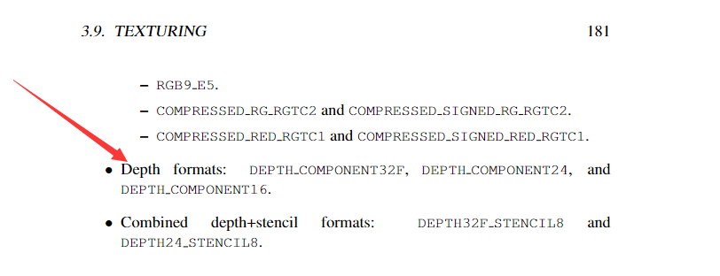
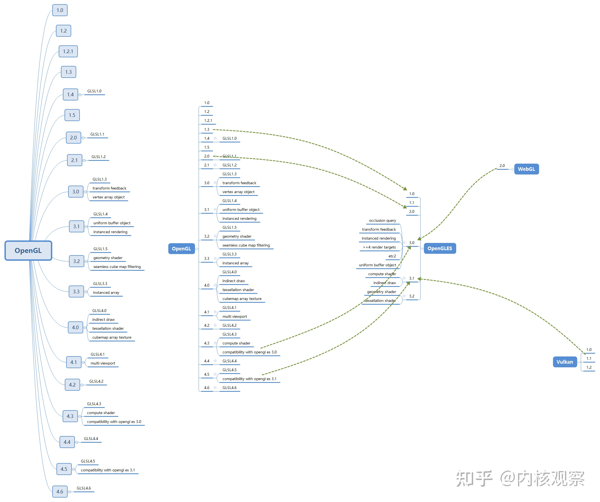

# GL

# GL 功能

## [各版本的 GL Spec](https://www.khronos.org/registry/OpenGL/index_gl.php)

#### 问题：如何 查看 各版本的 深度格式 支持

首先，上网查，查不到具体信息的时候：

+ 点击某个版本规范的PDF，搜索： renderBufferStorage 或 Required Texture Formats；
+ 结果是: GL 2.1 没有 framebuffer，只能靠 扩展
+ GL 3.0 以后 可以 直接用 DEPTH_COMPONENT24
+ 从 GL 和 GLES 的关系 类推，Gles2 不支持，Gles3 以后 都支持；
	- **注：** 需要 再次 查文档验证

## 各版本 功能

