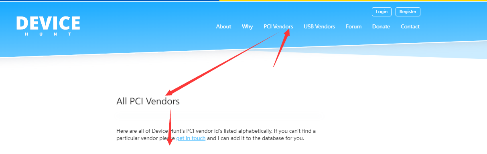
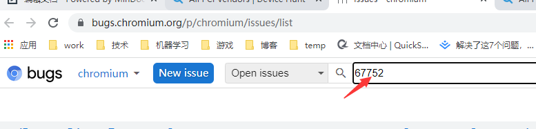
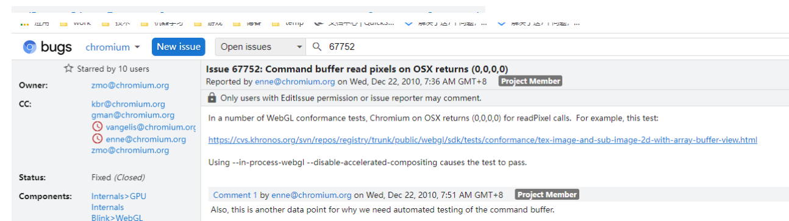
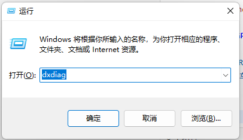
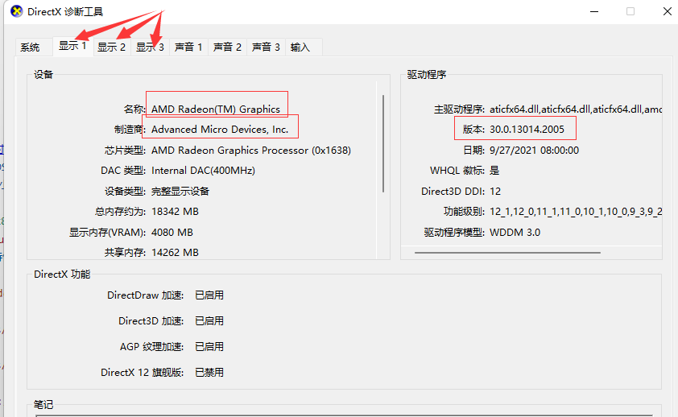

- [Webgl 驱动兼容性](#webgl-驱动兼容性)
  - [1. Chromium 的 WebGL 驱动黑名单](#1-chromium-的-webgl-驱动黑名单)
    - [1.1. 说明](#11-说明)
    - [1.2. 片段](#12-片段)
    - [1.3. 字段解析](#13-字段解析)
    - [1.4. 如何查device-id](#14-如何查device-id)
    - [1.5. 如何查chromium bug](#15-如何查chromium-bug)
  - [2. 查看windows GPU 设备](#2-查看windows-gpu-设备)

# Webgl 驱动兼容性

## 1. Chromium 的 WebGL 驱动黑名单

[Chromium 的 WebGL 驱动黑名单](https://chromium.googlesource.com/chromium/deps/gpu/software_rendering_list/+/refs/heads/main/software_rendering_list.json)

### 1.1. 说明

在 Chromium 的 源码上，有个 WebGL 黑名单，是 目前 用 Angle 或者 GPU-硬件驱动 有 Bug的；

只要符合这个 **黑名单** 上的，对应的特性一定要绕过去，不能直接用该OS的驱动实现webgl

### 1.2. 片段

``` json
{
	"id": 16,
	"description": "Multisampling is buggy in ATI cards on older MacOSX.",
	"cr_bugs": [67752, 83153],
	"os": {
		"type": "macosx",
		"version": {
			"op": "<",
			"number": "10.7.2"
		}
	},
	"vendor_id": "0x1002",
	"blacklist": [
		"multisampling"
	]
}
```

### 1.3. 字段解析

+ cr_bugs: [Chromium Bug 网站 对应的 问题 id](https://bugs.chromium.org/p/chromium/issues/)
+ os-type: Windows, Linux, MaxOS, Android, iOS, 等
+ os-version: 操作系统版本 比如 小于 10.7.2
+ vendor_id, device_id 厂商ID & GPU-设备ID
	- 比如 Intel 厂商的 id 是 0x8086
	- 到 [这里](https://devicehunt.com/) 查
+ blacklist: 如果中标，列表上的特性，只能用 mesa 软件模拟，不能用任何的 硬件加速，**必 定 有 坑**

### 1.4. 如何查device-id

[如何查device-id](https://devicehunt.com/)




### 1.5. 如何查chromium bug

[如何查chromium bug](https://bugs.chromium.org/p/chromium/issues/)





## 2. 查看windows GPU 设备

+ 快捷键：Win + R
+ 输入 dxdiag 回车
+ 看 显示 栏



