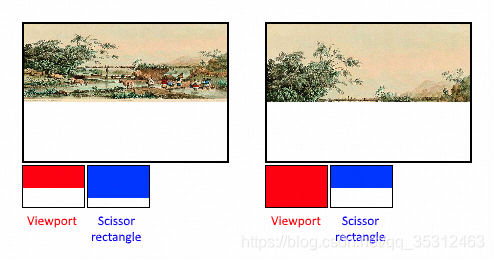

- [视口 和 裁剪](#视口-和-裁剪)
  - [1. 相关 API](#1-相关-api)
  - [2. Viewport & Scissor](#2-viewport--scissor)

# 视口 和 裁剪

## 1. 相关 API

+ gl.viewport(x, y, w, h)
	- 不影响 gl.clear
+ gl.scissor(x, y, w, h)
	- 配合：gl.enable(gl.SCISSOR_TEST) 使用，默认是 关闭
	- 会影响 gl.clear
+ gl.depthRange(zNear, zFar)

## 2. Viewport & Scissor

+ viewport 定义了 image图像 到 framebuffer帧缓冲区 的转换关系
+ scissor 矩形定义了哪些区域的像素被存储；任何在裁剪巨型外的像素都会在光栅化阶段丢弃；其功能 更像过滤器，而不是定义转换关系

如下图；需要注意的是，对于图像比viewport尺寸大的情形，左侧的裁剪矩形只是众多可能的一个表现。

