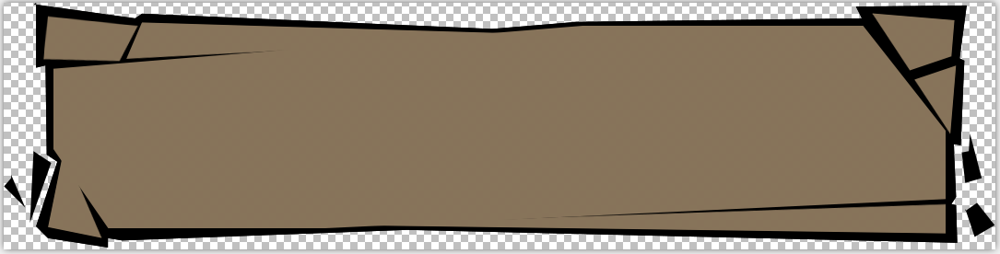

- [纹理-采样：透明边缘](#纹理-采样透明边缘)
  - [1. 背景：线性过滤 的 纹理 采样算法](#1-背景线性过滤-的-纹理-采样算法)
  - [2. 问题：白色描边](#2-问题白色描边)
  - [3. 3D网格：美术制作--解决思路](#3-3d网格美术制作--解决思路)
  - [4. 对 GUI 和 粒子效果 这种 没有太复杂 纹理uv坐标的场景](#4-对-gui-和-粒子效果-这种-没有太复杂-纹理uv坐标的场景)
    - [4.1. 想要 黑色描边](#41-想要-黑色描边)
    - [4.2. 通用情况：如果 边缘不是黑色，是任意颜色呢？](#42-通用情况如果-边缘不是黑色是任意颜色呢)
    - [4.3. 结论：如果需要效果正确](#43-结论如果需要效果正确)

# 纹理-采样：透明边缘



## 1. 背景：线性过滤 的 纹理 采样算法

``` c

// 线性过滤的插值算法，u，v是纹理坐标，[0, 1]
vec4 linearTexture2D(Texture tex, double u, double v) {
	// 得到真正的纹理像素位置
	u *= tex.size;
	v *= tex.size;

	int x = floor(u);
	int y = floor(v);

	// 得到 左边 和 上边 的插值系数
	double u_ratio = u - x;
	double v_ratio = v - y;

	// 用左右插值系数来计算上下两点的采样颜色；

	// 为什么这里的系数要反过来算，画个图想想就明白了
	vec4 up = (1.0 - u_ratio) * tex[x][y] + u_ratio * tex[x+1][y];
	vec4 bottom = (1.0 - u_ratio) * tex[x][y+1] + u_ratio * tex[x+1][y+1]);

	// 用上下插值系数来计算最终采样颜色；
	return (1.0 - v_ratio) * up + v_ratio * bottom;
}

```

## 2. 问题：白色描边

如上图所示，用Filter=Linear采样纹理时，由于线性插值的原因，对于途中的透明边缘部分，经常会采样出现白色的描边。

* 假设1：如果途中全透明部分的像素值为：（白色-全透明）rgba = (1.0, 1.0, 1.0, 0.0) 的时候
* 假设2：某个像素采样的四个点如下表所示，texture2D的插值系数 上方-为：0.4

则：采样出来的 rgba = (0.6, 0.6, 0.6, 0 * 0.6 + 0.8 * 0.4)，会偏白，渲染出来的，就可能会看到白色描边；

|||
|--|--|
|(1, 1, 1, 0)|(1, 1, 1, 0)|
|(0, 0, 0, 0.8)|(0, 0, 0, 0.8)|

## 3. 3D网格：美术制作--解决思路

因为3D网格有 uv坐标，所以对3D网格而言比较简单，将纹理不透明的边缘按原来的颜色外扩一圈，即可解决（纹理坐标决定了不可能采样到外部太远的部分）

## 4. 对 GUI 和 粒子效果 这种 没有太复杂 纹理uv坐标的场景

因为 GUI 都是四边形，没有太复杂的纹理坐标可言，所以，如果想避免出现不正确的边缘色，就得想些办法？

### 4.1. 想要 黑色描边

* 假设1：如果途中全透明部分的像素值为：（黑色-全透明）rgba = (0.0, 0.0, 0.0, 0.0) 的时候
* 假设2：某个像素采样的四个点如下表所示，texture2D的插值系数：插值系数 （上方）0.4

则：采样出来的 rgba = (0, 0, 0, 0.32)，偏黑，看不到白色

|||
|--|--|
|(0, 0, 0, 0)|(0, 0, 0, 0)|
|(0, 0, 0, 0.8)|(0, 0, 0, 0.8)|

### 4.2. 通用情况：如果 边缘不是黑色，是任意颜色呢？

|||
|--|--|
|(0, 0, 0, 0)|(0, 0, 0, 0)|
|(r, g, b, a)|(r, g, b, a)|

假设 全透明部分为黑色，插值系数 （上方）0.4，（左方）1.0

采样结果 = (0.4r, 0.4g, 0.4b, 0.4a)；

### 4.3. 结论：如果需要效果正确

* 3D-网格部分：可以让美术制作时，扩大一圈边缘 或者 用 (0, 0, 0, 0)
* 或者：在构建系统，全透明部分改为用：(0, 0, 0, 0)；