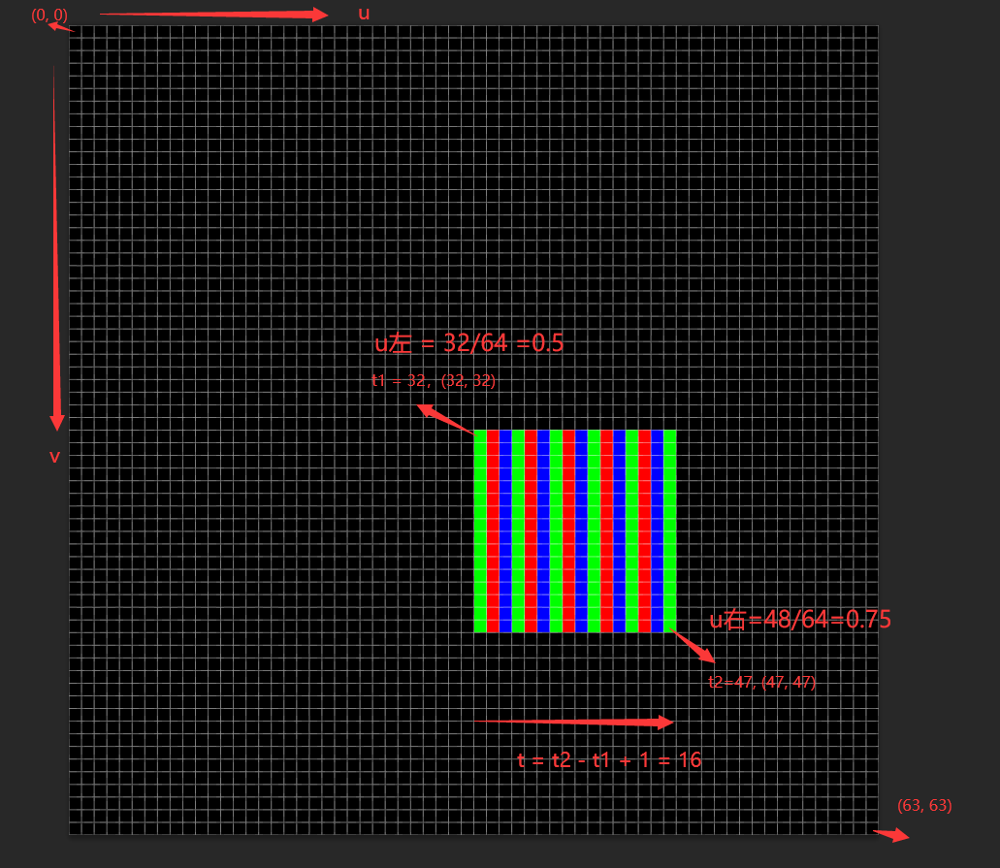
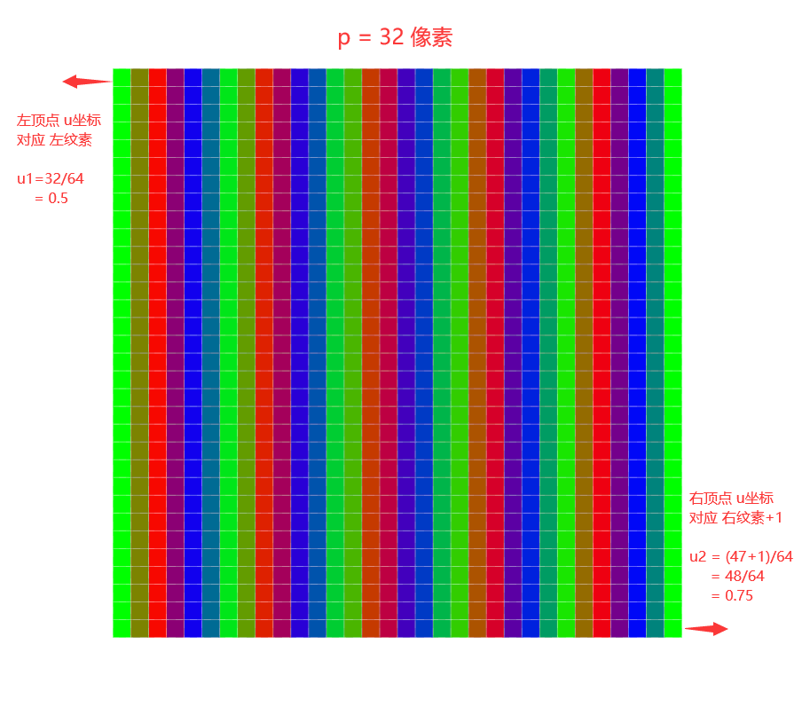

# 背景：OpenGL 纹理 采样 算法

注：这里为了简单，假设 是 GUI场合，相机用 正交投影，而且 投影变换正好将 canvas像素 一一对应。

先不管mipmap，如果是 线性过滤；

## 1. 如果不想看推导，拉到最后看结论

解决问题：如何让 GUI 的 纹素 和 像素 边缘 一 一 对 应

## 2. 图像说明

### 2.1. 纹理 大小 64*64，中间 (32,32) -- (47, 47) 是 要贴出来的区域：

### 2.2. 渲染到四边形是 32*32：

## 3. 事实1：光栅化：像素 和 插值

如果 四边形：

1、左边顶点的 纹理u坐标为 $$u_{1}$$，右边顶点 纹理u坐标为  $$u_{2}$$
2、像素着色器 正好将这个 四边形 渲染了 p个 像素

那么，会将 $$u_{2} - u_{1} $$ 平均分成 p分；

3、每个像素的u坐标间隔，公差：$$ d = \frac{u_2-u_1}{p} $$
4、光栅化后，左边 第一个像素 的 u坐标：$$ u_{1} + \frac{d}{2} $$

### 3.1. 例子

假设：

纹理宽度 w = 64，左右依次是：第0纹素，第1纹素，...，第63纹素
四边形，左边采样点：$$t_l=32$$ 纹素
四边形，右边采样点：$$t_r=48$$ 纹素
四边形 在最后 渲染了 p = 32 个像素

则 这 32个像素的u坐标的：

u1: $$u_l = \frac{t_l}{w} = \frac{32}{64} = 0.5 $$

u2: $$u_r = \frac{t_r}{w} = \frac{48}{64} = 0.75 $$

公差：$$ d = \frac{u_r-u_l}{p} = \frac{\frac{t_r}{w}-\frac{t_l}{w}}{p}=\frac{0.25}{32} $$

第1个像素：$$u_{l} + \frac{d}{2} = 0.5 + \frac{0.25}{64} $$

第2个像素：$$u_{l} + 2\frac{d}{2} = 0.5 + \frac{0.25}{64} $$

第3个像素：$$u_{l} + 3\frac{d}{2} = 0.5 + 3\frac{0.25}{64} $$

第31个像素：$$u_{l} + 31\frac{d}{2} = 0.5 + 31\frac{0.25}{64} $$

## 4. 事实2：0.5像素 采样

假设 纹理宽高 是 w，h

像素着色器中，某个 片段 的 u坐标 正好 是 (p + 0.5) / w，p是 整数，那么 texture采样到的 颜色值 纹理的第p个像素；

### 4.1. 例子

+ 如果 texture 宽度 是 64，高度为1，从左往右，依次是 纹素0，纹素1，...，纹素63；
+ 假设：某个像素的 u值 是 0.4921875；
+ 那么 64 * 0.4921875 = 31.5
+ 则 采样出来的颜色 就是 第31个纹素 的值

## 5. fs：texture2D(s, uv) 线性过滤 算法

以 u坐标 为例，假设 纹理 宽度 为 w；

计算 x值 $$ x = w \times u - 0.5 $$
左边纹素：$$ t_l = \lfloor x \rfloor $$
右边纹素：$$ t_r = t_l + 1 $$
左边 比例系数：$$ f = t_r - x $$
得到颜色：$$ color = f * T[t_l] + (1-f) * T[t_r]$$

### 5.1. 完整算法

x值: $$ x = w \times u - 0.5 $$

y值: $$ y = h \times v - 0.5 $$

**左下：**
纹素：$$ t_{lb} = (\lfloor x \rfloor, \lfloor y \rfloor) $$
比例：$$ f_{lb} = (1,1) - (x,y) + t_{lb} $$

**左上：**
纹素：$$ t_{lt} = (t_{lb}.x, 1 + t_{lb}.y) $$
比例：$$ f_{lt} = (f_{lb}.x, 1 - f_{lb}.y) $$

**右下：**
纹素：$$ t_{rb} = (1 + t_{lb}.x, t_{lb}.y) $$
比例：$$ f_{rb} = (1 - f_{lb}.x, f_{lb}.y) $$

**右上：**
纹素：$$ t_{rt} = (1 + t_{lb}.x, 1 + t_{lb}.y) $$
比例：$$ f_{rt} = (1 - f_{lb}.x, 1 - f_{lb}.y) $$

**采样颜色：**
$$ f_{lb} \times T[t_{lb}] + f_{lt} \times T[t_{lt}] + f_{rb} \times T[t_{rb}] + f_{rt} \times T[t_{rt}] $$

### 5.2. 例子1：以 u 为例

假设：$$ u \times w = 32.25 $$
假设：$$ x = u \times w - 0.5 = 31.75 $$
左边纹素：$$ t_l = \lfloor x \rfloor = 31 $$
右边纹素：$$ t_r = t_l + 1 = 32 $$
左边 比例系数：$$ f = 32 - 31.75 = 0.25 $$
得到颜色：$$ color = 0.25 * T[31] + 0.75 * T[32] $$

### 5.3. 例子2：以 u 为例

假设：$$ u \times w = 31.75 $$
假设：$$ x = u \times w - 0.5 = 31.25 $$
左边纹素：$$ t_l = \lfloor x \rfloor = 31 $$
右边纹素：$$ t_r = t_l + 1 = 32 $$
左边 比例系数：$$ f = 32 - 31.25 = 0.75 $$
得到颜色：$$ color = 0.75 * T[31] + 0.25 * T[32] $$

### 5.4. 例子3：以 u 为例

假设：$$ u \times w = 31.5 $$
假设：$$ x = u \times w - 0.5 = 31 $$
左边纹素：$$ t_l = \lfloor x \rfloor = 31 $$
右边纹素：$$ t_r = t_l + 1 = 32 $$
左边 比例系数：$$ f = 32 - 31 = 1.0 $$
得到颜色：$$ color = 1 * T[31] + 0 * T[32] = T[31] $$

## 6. 缩放采样，如何让 边缘处保持 清晰

纹理 宽度 w

四边形 左边对应 纹素 为 $$t_l$$
四边形 右边对应 纹素 为 $$t_r$$
渲染纹素为：$$t = t_r - t_l + 1 $$

四边形在像素着色器 渲染的像素为 p 个

左顶点 纹理坐标：$$ u_1 = \frac{t_l + x}{w} $$

右顶点 纹理坐标：$$ u_2 = \frac{t_l + t - x}{w} $$

根据上面事实，像素着色器左边第一个像素的u坐标为：

$$ u = u_1 + \frac{u_2 - u_1}{2p} $$

现在希望 偏移 x 后，能让 $$ u = \frac{t_l}{w} + \frac{1}{2w} $$

关于x的方程：$$ u_1 + \frac{u_2 - u_1}{2p} = \frac{t_l}{w} + \frac{1}{2w} $$

解方程，得到：$$ x = \frac{p - t}{2(p-1)} $$

## 7. 结论

如果想让 纹理边缘清晰，需要偏移：

左右各偏移 像素：$$ x = \frac{p_w-t_w}{2(p_w-1)} $$

上下各偏移 像素：$$ y = \frac{p_h-t_h}{2(p_h-1)} $$

如果是 要计算纹理坐标，还要 $$ \frac{x}{w} $$

如果是 要计算纹理坐标，还要 $$ \frac{y}{h} $$

左 加 右 减，上 加 下 减；

$$ (p_w, p_h) $$ 是 该四边形 在 像素着色器 实际绘制了 多少个像素 

$$ (t_w, t_h) $$ 是 想渲染的纹理 有 多少纹素

### 7.1. 例子

假设 纹理 w = 64, h = 64

将 纹理中 $$(t_w, t_h)=(16,16)$$ 大小的区域 渲染到 (32,32) 像素的四边形

偏移：$$ \frac{32-16}{2w * (32-1)} = \frac{16}{62*w}= 0.00403226 $$

左顶点 u坐标 加上：0.00403226
左顶点 u坐标 减去：0.00403226

### 7.2. 推论

要保证 边缘清晰，需要移动的像素值 仅仅和 要渲染的纹理 大小、四边形实际渲染的像素大小 有关，和 四边形起点，纹理起点，纹理大小 无关！