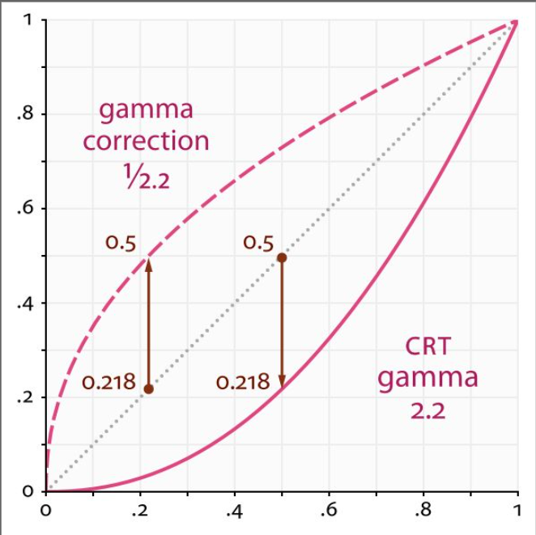
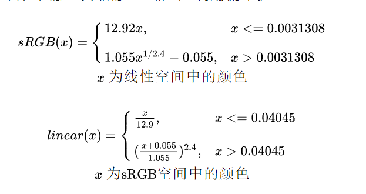

# 颜色空间

## 1. 参考

+ [Unity: 线性 和 Gamma空间](https://docs.unity3d.com/Manual/LinearRendering-LinearOrGammaWorkflow.html)

## 2. Linear 和 Gamma 空间

+ 所谓：x^2.2 仅仅是 个 近似而已
	- gamma2linear(x): x^2.2
	- linear2gamma(x): x^(1/2.2) = x^0.4545

## 3. `sRGB` 纹理格式

实际使用中，一般都用 2.2 或 0.4545 简化

## 4. `重点`：工作流

+ 存颜色的纹理，美术 制作，保存成 sRGB格式
+ 采样颜色纹理：gamma --> linear
	- 用 sRGB 格式
	- 自己在shader实现 ^2.2
+ 光照颜色，雾颜色
	- 如果涉及到 线性衰减，需要：在 gamma空间做 线性混合，这样得到的结果是线性的
	- 其他时候，用 在 线性空间 做计算
+ shader 输出
	- 如果是FBO：则 `TODO`
	- 如果是 屏幕，则 linear --> gamma （^0.4545)

## 5. 什么东西需要变成 gamma
