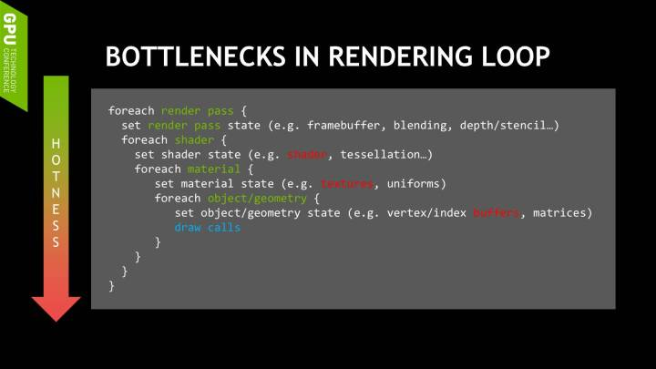
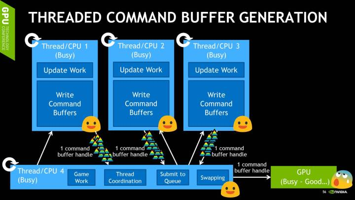

- [编程模型](#编程模型)
  - [1. Vulkan 的 无状态模型](#1-vulkan-的-无状态模型)
  - [2. 更新 资源](#2-更新-资源)
  - [3. 伪代码](#3-伪代码)
  - [4. 多线程渲染](#4-多线程渲染)
    - [4.1. 第一种模式](#41-第一种模式)
    - [4.2. 第二种模式](#42-第二种模式)
  - [5. 实现](#5-实现)
  - [6. 参考](#6-参考)

# 编程模型

## 1. Vulkan 的 无状态模型

可以这么认为：**每次 Draw 指令的调用都会 重置 所有状态（Pipeline，Descriptor Set 等）**

## 2. 更新 资源

这和传统API中，只要你不改某个状态，某个状态就一直不会变，这一点很不一样。

+ 最优做法：索引和顶点共用同一个Buffer，通过不同的offset区分；
+ 批量 资源 分配、更新的 最佳频率 就是 资源本身的更新频率；

## 3. 伪代码




``` rs

/// 渲染图：给定 渲染目标，将这一帧的指令渲染上去；
struct RenderGraphics {
	targets: Vec<FrameBuffer>,
	queue: Vec<RenderQueue>;
}

/// 渲染队列：相同pipeline的组合
struct RenderQueue {
	// 这里包括了：Shader & 着色器布局 & 渲染状态
	pipeline: Pipeline,

	// 按材质分类的Mesh
	meshes_map: Map<Material, Vec<Mesh>>,
}

// 材质：UniformBuffer，（可选）通用的TextureImage
struct Material {
	ubos: Vec<UniformBuffer>,
	images: Vec<TextureImage>
}

// 网格：针对该物体的材质，网格数据
// 可实例化；
struct Mesh {
	material: Material,
	instance_info: InstanceInfo,

	indies: Option<IndexBuffer>,
	vertex: Vec<VetexBuffer>,
}

impl RenderGraphics {

	fn draw_to_buffer(&self, &mut buffer: CommandBuffer) {

		buffer.begin_render_pass();

		for queue in self.queue {
			buffer.bind_pipeline(&queue.pipeline);
			for (material, mesh) in queue.meshes_map {
				let ubo = merge(material, mesh.material;
				buffer.bind_descriptor_sets(set);

				buffer.bind_vertex_buffer();

				if mesh.indies.is_none() {
					buffer.draw();
				} else {
					buffer_bind_index_buffer();
					buffer.draw_indexed();
				}
			}
		}
		buffer.end_render_pass();
	}
}

```

## 4. 多线程渲染

+ Vulkan 禁止 多线程 同时 操作 单个Queue（换句话，Queue不是线程安全的），所以申请多个 Queue 能做到 多线程做Submit。
+ Queue 有三种类型：Graphics，Compute，Tranlate；
	- Graphics: 三种操作都能做；
	- Compute: 不能做 Graphics；
	- Translate: 只能做 拷贝；

### 4.1. 第一种模式

+ CPU 并行更新 Buffer，同时处理 几帧，以 Round Robin 的方法 更新 并 使用 这些资源；
+ `TODO` 某个数据，如果还没读取，就被别的线程更新，则 报错
+ 通过`Event`同步：在 Cmd 中插入 Event；这样App运行到该处时，会等到setEvent调用，才会更新指定资源；

### 4.2. 第二种模式

+ 多个线程 使用 不同的 CmdBuffer 场景的不同部分
+ 最后放到主线程提交到同一个队列
+ 每线程都有 独立的 CmdPool，以便 做任何Command Buffer相关的操作

## 5. 实现

+ 需要跟踪有多少 frames 处于 in-flight 状态
+ triple-buffer 多线程
	- SwapChain Image: 3
	- CmdPool & CmdBuffer: 3
	- 更新的 Res：3 * n，n是一帧需要的资源数 (多线程：写时复制)



## 6. 参考

* [Vulkan 多线程](https://developer.nvidia.com/sites/default/files/akamai/gameworks/blog/munich/mschott_vulkan_multi_threading.pdf)
* [从Vulkan API看Shader的数据绑定机制](https://zhuanlan.zhihu.com/p/111882744)
* [Vulkan 多线程渲染](https://zhuanlan.zhihu.com/p/165341403)
* [三缓冲](https://techsingular.net/2017/12/29/triple-is-more-than-double-plus-one/)
* [Android 屏幕刷新 的秘密 — VSync、Choreographer](https://zhuanlan.zhihu.com/p/196667810)