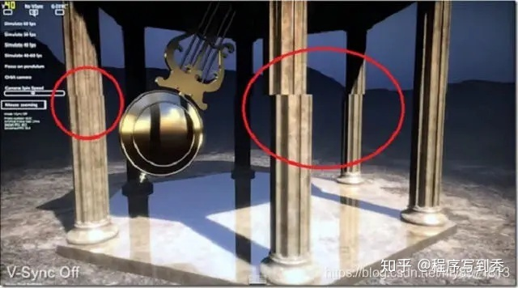
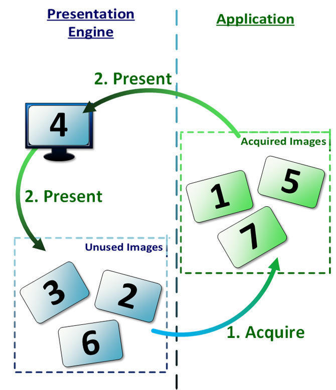
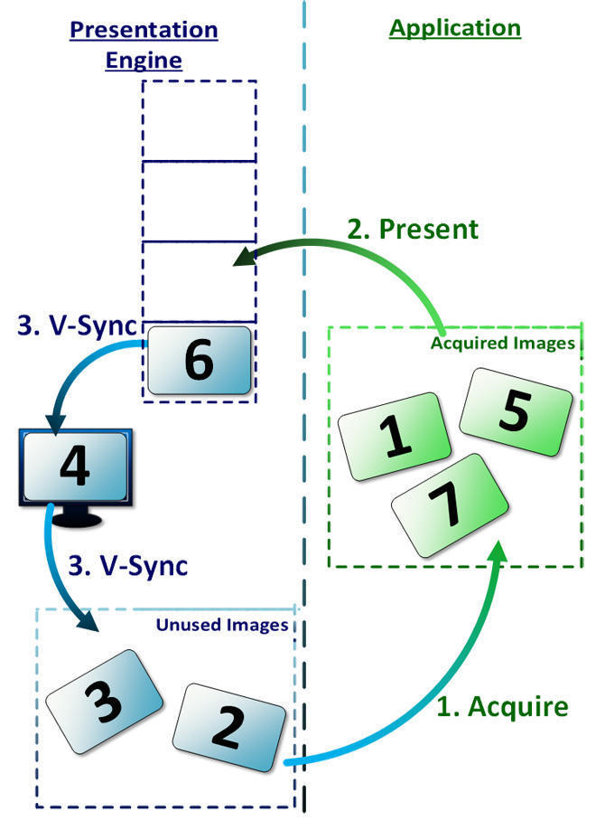
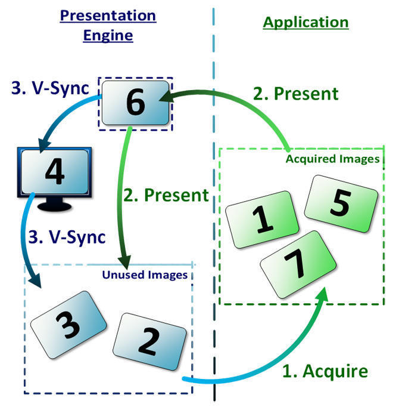

- [关于 三缓冲](#关于-三缓冲)
  - [1. 简化 的 渲染流程](#1-简化-的-渲染流程)
  - [2. 两个 指标：刷新率 & FPS](#2-两个-指标刷新率--fps)
    - [2.1. 单缓冲：GPU渲染 和 显示器显示 用 同一个缓冲；](#21-单缓冲gpu渲染-和-显示器显示-用-同一个缓冲)
  - [3. 多缓冲的：呈现策略](#3-多缓冲的呈现策略)
    - [3.1. 多缓冲 与 呈现策略](#31-多缓冲-与-呈现策略)
      - [3.1.1. Immediate 立即模式](#311-immediate-立即模式)
      - [3.1.2. Fifo：先进先出](#312-fifo先进先出)
      - [3.1.3. Fifo-Relaxed：松散 的 先进先出](#313-fifo-relaxed松散-的-先进先出)
      - [3.1.4. Mail-Box：适用 三缓冲模式 的场景；](#314-mail-box适用-三缓冲模式-的场景)
  - [4. 三缓冲](#4-三缓冲)
    - [4.1. 三缓冲 如何 实现？](#41-三缓冲-如何-实现)
  - [5. JS 回调 Request-Animation-Frame 的 时机](#5-js-回调-request-animation-frame-的-时机)
    - [5.1. CPU满负荷推动](#51-cpu满负荷推动)
    - [5.2. CPU按30帧的频率推动](#52-cpu按30帧的频率推动)
    - [5.3. raf调用时机 （未有定论，初稿）](#53-raf调用时机-未有定论初稿)
  - [6. 参考](#6-参考)

# 关于 三缓冲

本文 描述 三缓冲的机制；

## 1. 简化 的 渲染流程

为什么这里是 “简化模型” ？因为：如果是多窗口系统，每个窗口的“合成”需要在OS层再处理一次；所以这里讨论的是全屏独占的情况下的流程；

编码 --> 渲染 --> 显示

* CPU: 编码（Encode）
    + 获取 可用的 Image
    + 将 渲染命令 编码 到 命令缓冲区，并通过命令队列 提交 给GPU；
* GPU: 渲染-呈现
    + 渲染（Render）：GPU执行指令，渲染到 Image；
    + 呈现（Present）：按指定规则，将Image 送到 呈现队列；
* 显示器：显示
    + 按固定帧率刷屏，每次刷新完毕后，发vsync信号；

**注意：** 控制 渲染 和 呈现 的是 CPU，执行者是 GPU ！

## 2. 两个 指标：刷新率 & FPS

刷新率：和 显示器 显示 有关；

* 屏幕刷新率：显示器 一秒内 刷新的次数，单位HZ；
* 刷新时，从左往右，从上往下，顺序的 一批批像素点 显示出来；以 刷新率 60HZ 为例，基本就是 16ms **以内** 刷新整个屏幕；
* 每次刷新完成 到下一次 刷新Image的开始 那段时间，会向 cpu发送一个垂直同步 **vsync** 信号，这时：
    + 通常显卡会将 显示器刷屏 Image 为 呈现队列的 Image；（策略见下面）
    + CPU通常可以进行下一帧的数据准备工作；

FPS：GPU 渲染 有关；

帧率 Frame Rate：GPU一秒内能渲染多少个Image；单位:**fps**；

### 2.1. 单缓冲：GPU渲染 和 显示器显示 用 同一个缓冲；

无论等不等vsync的节拍，都会遇到：“Tearing”现象；

画面撕裂（tearing）：如果 显示器刷新一张Image到一半的时候，显卡 告诉显示器用新的Image呈现，那么 会看到前面一半是旧图片，后面一半是新图片；如下图：

**注：** 如果是动画，那么会特别明显；

为了在 实时渲染中 解决这个问题，至少要用 双缓冲；

## 3. 多缓冲的：呈现策略

### 3.1. 多缓冲 与 呈现策略

Vulkan API 定义了 几种策略，重点是：区分 呈现 和 替换 当前显示的Image 这两种行为；

* Vulkan有获取“可用图像”的概念：在下面模式中，所谓“可用图像”，就是放到 “可用队列”的Image，也就是图中的Unused Images；
* Vulkan API：available_sp，会等到该图放回到Unused Images队列中时，才会唤醒；

#### 3.1.1. Immediate 立即模式

* 当Present时，不等vsync信号，直接将 呈现的Image 置为 显示器刷屏的Image；
    + 原来刷屏的Image，放回到可用Image池；供Vulkan-API获取；
* 缺点：容易看到撕裂现象；

#### 3.1.2. Fifo：先进先出

* Vulkan规范规定，所有 Vulkan驱动 必须支持该模式；
* Present(Image)时：呈现队列.add(Image);
* vsync时：
    + 可用队列.add(显示器刷屏Image)
    + 显示器刷屏Image = 呈现队列.remove();
    + 如果：呈现队列.isEmpty()，则 用 当前的 显示器刷屏Image；
    + 如果 用光了可用的Image（一般是创建时候准备好，比如3缓冲，一般就是3张Image）；
        * CPU 就无法渲染，可以 通过 Fence 检查 和 堵塞等待；

#### 3.1.3. Fifo-Relaxed：松散 的 先进先出

和FiFo唯一的区别就是，如果上次vsync队列为空，那么这一次present的Image会立即变成Front-Image，不会等到这一次vsync触发；

#### 3.1.4. Mail-Box：适用 三缓冲模式 的场景；

三缓冲 的 理想：

* 一个用来 vsync刷屏；
* 一个用来 GPU-渲染，和 呈现；
* 一个用来 做 CPU-准备；

* Present队列：只有一个Image
* Present(Image)，会：
    + 可用队列.add(Present.remove());
    + Present.add(Image));
* vsync时
    + 可用队列.add(显示器刷屏Image);
    + 显示器刷屏Image = Present.remove()

这种模式下：用户看到的图像永远是最新的，**但是：** 如果一个vsync内多次present，有可能**跳帧**；

## 4. 三缓冲

三缓冲的出现，目的是：减少 卡顿；充分利用 CPU-GPU 吞吐；

* In-Flight：一个Image从CPU开始编码，到显卡渲染完毕并呈现的 整个过程；
* 两个测量指标：
	+ 刷屏帧率：60HZ，有显示系统决定；
	+ 渲染帧率：60fps；
* 一般卡点在：渲染 < 刷屏；

三 Image 缓冲 作用：

* 一个用于CPU，填下一帧渲染指令；
* 一个用于GPU，执行本帧的渲染；渲染完毕后 呈现 present；
* 一个用于 正在刷屏；

瓶颈情况：

* CPU；
	+ 执行 GC；
	+ 执行 定时器 回调；
	+ 执行 更新数据，比如 动画，布局，视锥裁剪；
* GPU 是瓶颈；
	+ 渲染流水线的某一部分是瓶颈；
* vsync 是瓶颈
	+ 只有等，快了也没用；

重点分析 CPU是瓶颈的情况，因为这才是我们游戏的现状：

### 4.1. 三缓冲 如何 实现？

* 需要 知道 GPU何时，结束 渲染Image Present --> fence
* 需要 知道 vsync信号，OS事件；
* 需要 API 提供 GPU指令同步的能力。
* 需要 交换链 有 多个 开辟 3个Image的能力；
* 需要 准备 多套：Uniform Buffer --> Copy On Write

## 5. JS 回调 Request-Animation-Frame 的 时机

如果CPU是瓶颈，是不是越快推动CPU越好，并不是！

目的：尽可能的保持平滑。

### 5.1. CPU满负荷推动

### 5.2. CPU按30帧的频率推动

可以看到，如果CPU达不到60帧的要求，按30帧推动，更平滑，没有过多的抖动

### 5.3. raf调用时机 （未有定论，初稿）

* 对齐 vsync
* 统计 最近一段事件内的 平均fps
	+ 一帧的时间：通过计算 两次 GPU执行 Present 的 时间差 去 计算；
	+ 需要一个缓冲记录多帧时间的一个 均值 和 方差，比如：3-5 帧；
	+ 如果 均值 下降 一半，而且 方差 较少，则将：raf的触发间隔调整多一个vsync；

## 6. 参考

+ 屏幕刷新 与 呈现
    * [Android屏幕刷新机制](https://zhuanlan.zhihu.com/p/196667810)
	* [Vulkan 绘制与显示](https://zhuanlan.zhihu.com/p/166423581)
+ Jank卡顿 与 三缓冲
    * [游戏 需要 关注 Jank卡顿 吗](https://zhuanlan.zhihu.com/p/142234137)
    * [三缓冲的机制](https://techsingular.net/2017/12/29/triple-is-more-than-double-plus-one/)
+ TextureView的缺陷：前面知识点的综合运用
    * [TextureView 的血与泪（完整修订版）](https://zhuanlan.zhihu.com/p/147322501)