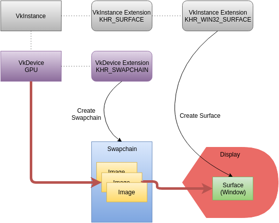

- [交换链 SwapChain](#交换链-swapchain)
  - [1. WSI扩展：渲染API 和 平台窗口 的交互；](#1-wsi扩展渲染api-和-平台窗口-的交互)
  - [2. 参考](#2-参考)

# 交换链 SwapChain

## 1. WSI扩展：渲染API 和 平台窗口 的交互；

* SwapChain 向 窗口 申请多个Image，用于显示到屏幕；
* GraphicQueue执行CommandBuffer，渲染到Image中；然后将Image 呈现（Present）到窗口显示屏上；

## 2. 参考

* [Vulkan编程指南：render & present](https://zhuanlan.zhihu.com/p/166423581)