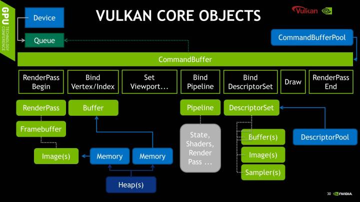

- [指令录制](#指令录制)
  - [1. 概念](#1-概念)
  - [2. 伪代码](#2-伪代码)

# 指令录制



## 1. 概念

* RenderPass
* Pipeline
* DynamicState
	+ Viewport & Scissor
	+ Blending Constant
	+ Line Width
* DescriptorSet
	+ Uniform Buffer
	+ Image Buffer
	+ Texture Sampler
* VertexBuffer & IndexBuffer

## 2. 伪代码

``` rs

let point = vk::PipelineBindPoint::GRAPHICS;

cmd.begin_render_pass(&render_pass, vk::SubpassContents::INLINE);

cmd.bind_pipeline(point, pipeline);

let vertex_buffers = [vertex_buffer];
let offsets = [0_u64];
let descriptor_sets_to_bind = [descriptor_sets[i]];

cmd.bind_vertex_buffers(0, &vertex_buffers, &offsets);

cmd.bind_index_buffer(ib, 0, vk::IndexType::UINT32);

cmd.bind_descriptor_sets(point, pipeline_layout, 0, &descriptor_sets_to_bind, &[]);

cmd.draw_indexed(RECT_INDICES_DATA.len() as u32, 1, 0, 0, 0);

cmd.end_render_pass();

// 最后，结束缓冲区录制时调用：device.end_command_buffer(cmd)

``` 