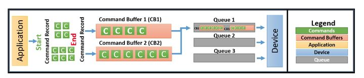
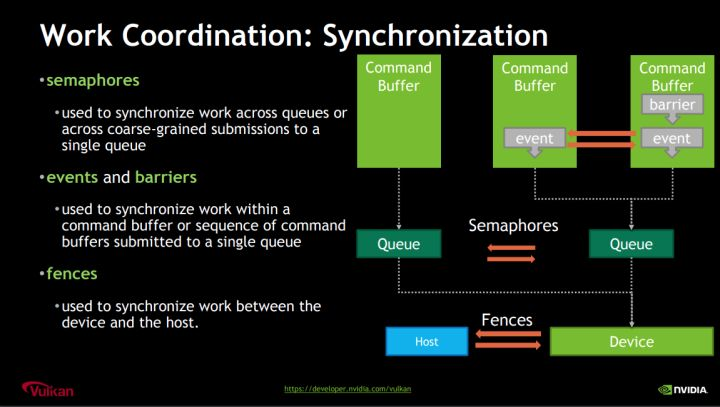
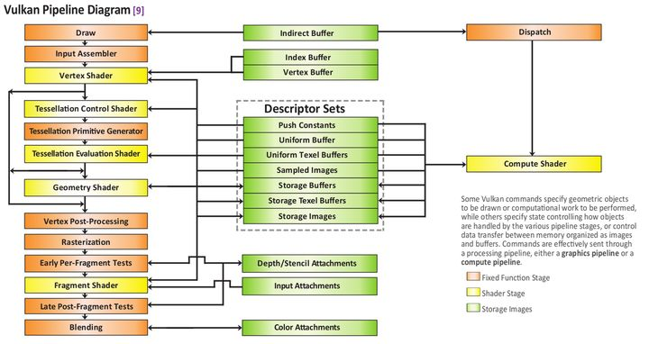
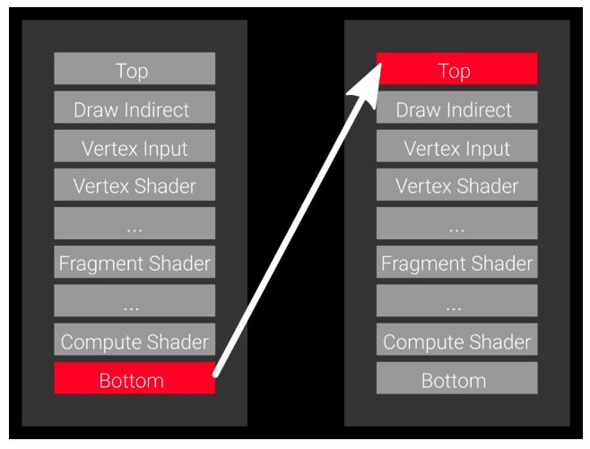
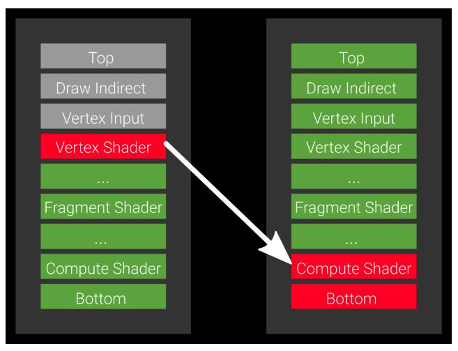
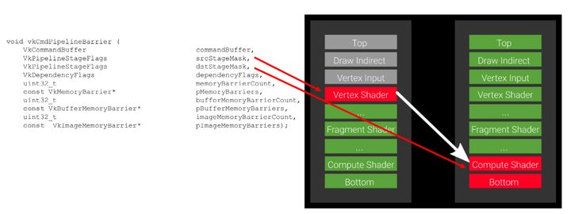

- [Vulkan 同步](#vulkan-同步)
  - [1. Cmd 执行 顺序](#1-cmd-执行-顺序)
  - [2. 四种 同步 工具](#2-四种-同步-工具)
  - [3. Fence（栅栏）](#3-fence栅栏)
  - [4. Semaphore（信号量）](#4-semaphore信号量)
  - [5. Event（事件）](#5-event事件)
  - [6. Barrier（屏障）](#6-barrier屏障)
    - [6.1. Pipeline 阶段：共 11个](#61-pipeline-阶段共-11个)
    - [6.2. 使用场景](#62-使用场景)
    - [6.3. 创建：vkCmdPipelineBarrier](#63-创建vkcmdpipelinebarrier)
  - [7. 参考](#7-参考)

# Vulkan 同步

## 1. Cmd 执行 顺序

Queue --> CmdBuffer --> Cmd

没有同步原语的约束下：

+ 同一个CmdBuffer 的 命令，先记录 先执行；
+ 同一个Queue 的 CmdBuffer，先提交 先执行；
+ 同一个Queue 同时提交的 CmdBufffer，按 创建时 返回的下标决定，下标小的先执行；

## 2. 四种 同步 工具

从上往下，粒度 越 来 越 细

+ `Fence（栅栏）`: GPU -- CPU
	- 同步 Queue 和 渲染线程
+ `Semaphore（信号量）`: GPU 执行 不同Queue / 同一Queue不同Submit 之间 同步
	- 同步 Queue
+ `Barrier（屏障）`: 同一个 Pipeline 内 用于 访问资源的 GPU 同步
	- 防止指令乱序（资源 读写 乱序）
+ `Event（事件）`：GPU 同一队列 不同 CmdBuffer 之间 同步
	- Execution Barrier 升级版

## 3. Fence（栅栏）

GPU --> CPU

+ 队列提交时，作为参数传到GPU；vkQueueSubmit/vkQueueBindSparse，用于判断当前队列是否繁忙；
+ vkGetFenceStatus /  vkWaitForFences 查询 fence的状态；

## 4. Semaphore（信号量）

不同Queue / 同一Queue不同Submit

+ 经典用法： Prensent、Render 之间的 同步

在 队列提交 时 vkQueueSumit() 时，有：pWaitDstStageMask, pWaitSemaphores, pSignalSemaphores

+ 该 CmdBuffer 执行到 pWaitDstStageMask 对应阶段 前，等待 对应 pWaitSemaphores 的 信号量 变为 sinal态
+ 该 CmdBuffer 全部执行 完毕后，将 pSignalSemaphores 变为 sinal态

## 5. Event（事件）

Execution Barrier 升级版，只能 用于 同一Queue 的同步 ！

比如 GPU 在 读取某个资源 之前，CPU 不 能 更 新 ！

+ 创建：vkCreateEvent
+ CPU：vkSetEvent, vkResetEvent, vkGetEventState
+ GPU：vkCmdSetEvent，vkCmdResetEvent，vkCmdWaitEvent

## 6. Barrier（屏障）

+ 防止 资源读写 乱序；避免`hazards`（`RaW`, `WaR`,`WaW`）
+ 两种 Barrier：Execution Barrier、Memory Barrier

### 6.1. Pipeline 阶段：共 11个

### 6.2. 使用场景

+ 两个 Pipeline：P1、P2
+ P1 通过 VS 写 Buffer
+ P2 在 CS 读 同一 Buffer

方案1：用Fence，等P1全部执行完毕，再执提交P2；GPU无法并行，因为P2的CS在最后面；

方案2：用Barrier 告诉Vulkan，P2的CS输入 会依赖 P1的VS输出

### 6.3. 创建：vkCmdPipelineBarrier

## 7. 参考

+ [Vulkan 多线程渲染](https://zhuanlan.zhihu.com/p/165341403)
+ [Vulkan 同步 之 Fence、Semaphore](https://zhuanlan.zhihu.com/p/24817959)
+ [Vulkan 同步 之 Barrier、Event](https://zhuanlan.zhihu.com/p/80692115)
+ [介绍Vulkan同步](http://themaister.net/blog/2019/08/14/yet-another-blog-explaining-vulkan-synchronization/)