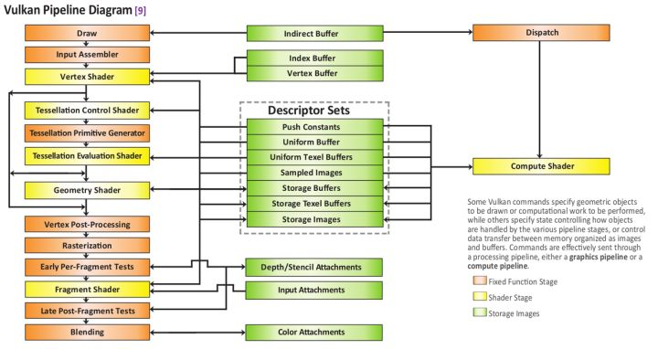
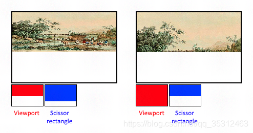

- [Pipeline 管线](#pipeline-管线)
  - [1. ShaderModule 各阶段 Shader](#1-shadermodule-各阶段-shader)
  - [2. PipelineLayout](#2-pipelinelayout)
  - [3. VertexInputState](#3-vertexinputstate)
  - [4. InputAssemblyState](#4-inputassemblystate)
  - [5. ViewportState](#5-viewportstate)
  - [6. RasterizationState](#6-rasterizationstate)
  - [7. DepthStencilState](#7-depthstencilstate)
  - [8. ColorBlendState](#8-colorblendstate)
  - [9. MultisampleState](#9-multisamplestate)
  - [10. 参考](#10-参考)

# Pipeline 管线

管理渲染状态的集合

特点：除了DynamicState外，其余初始化后 不可变

Pipeline 体现了渲染一个物体的所有阶段，需要的所有的GPU状态；




大概状态如下：

``` rs

struct Pipeline {

	// 该Pipeline 作用的 渲染目标；
	subpass_index: i32,
	rende_pass: RenderPass,

	// 各阶段Shader：VS，TSControl，TSEvaluation，GS，FS
	shaders: Map<ShaderType, Option<ShaderModule>>, // ShaderModule 是 spir-v 格式

	// UniformBuffer 布局：绑定点的对应关系
	pipeline_layout: PipelineLayout,

	// VS 属性布局，包括：每顶点属性 和 每实例属性；
	vertex_state: VertexInputState,

	// 拓扑结构：线，三角形列表 等
	input_assembly_state: InputAssemblyState,

	// TS 内置流程 的 状态
	tessellation_state: TessellationState,

	viewport_state: ViewportState, 				// 视口 & 裁剪窗口
	rasterization_state: RasterizationState,	// 光栅化
	depth_stencil_state: DepthStencilState,		// 深度模板
	color_blend_state: ColorBlendState,			// 颜色混合
	multisample_state: MultisampleState,		// 多重采样
}

```

## 1. ShaderModule 各阶段 Shader

* VS，TS-Control，TS-Evaluation，GS，FS
* 必须：VS, FS
* spir-v 格式，目前可与各种shader格式互转；（hlsl，glsl，...）

## 2. PipelineLayout

shader中 的 UniformBuffer 布局：绑定点的对应关系

* Descrpitor：在Shader中的 一个 Uniform数据；
* DescrpitorSet：这个 pipeline中 的 所有Shader 用到的 Uniform数据；
* DescrpitorSetLayout = DescriptorBinding[]，描述所有的Shader中的 Uniform绑定；
* PipelineLayout = DescrpitorSetLayout & PushConstantRange[]

最终绑定 DescriptorSet的时候，需要指定 对应的 binding-index；

推送常量（Push Constants）:一般用于对单个待绘制物体中所有的顶点都相同的量，比如，物体的基本变换矩阵、物体的最终变换总矩阵等

``` rs

struct PipelineLayout {
	desc_set_layouts: Vec<DescriptorBinding>,
	push_constants: Vec<PushConstantRange>,
}

struct PushConstantRange {
    pub stage_flags: ShaderStageFlags,
    pub offset: u32,
    pub size: u32,
}

// 映射到Shader中的一个 UBO | Sampler
struct DescriptorBinding {
	binding: 0, // shader中的binding：layout (binding = 0) uniform UBO { ... }
	descriptor_type: vk::DescriptorType::UNIFORM_BUFFER, // Sampler, UB, Image
	descriptor_count: 1,
	stage_flags: vk::ShaderStageFlags::VERTEX, // 用于vs
	samplers: Vec<Sampler>,
}

```

## 3. VertexInputState

VS 属性布局，包括：每顶点属性 和 每实例属性

一个Buffer可以定义多个Binding，一个Binding可以对应多个属性；

用于告诉GPU，VS接受的顶点数据的格式是怎样的：

* Binding：是 VertexBuffer 的格式
	+ binding-index：在 绑定 VertexBuffer 时，要将 VB 和 这个 binding-index 对应起来；
	+ 数据大小
	+ 每顶点 还是 每实例 数据
* Attribute：是 和 VertexShader 中 的 layout (location = x) in vec3 inPos; 对应的信息；
	+ binding-index：上面的索引
	+ location: shader定义的那个位置
	+ 格式：是RGB的f32，还是ARGB8，注入此类的；
	+ 偏移：因为一个binding有多个属性，所以这里需要指定偏移量；

``` rs

struct VertexInputState {
	bindings: Vec<Binding>,
	attributes: Vec<Attribute>,
}

// bind_buffer 时会和这个关联
struct Binding {
	index: i32, 	// 给Attribute描述的索引；
	stride: u32, 	// 该绑定对应的一个顶点有多少字节；
	input_rate: 每顶点 还是 每实例；
}

// 用于指定shader和binding的关系，描述一个属性；
struct Attribute {
	binding: i32,   // 对应上面的绑定描述
	location: i32,  // 对应shader的location
	format: Format, // 比如：RGBA8_SFLOAT 之类的描述
	offset: i32,	// 在bingding中的偏移
}

```

## 4. InputAssemblyState

图元的拓扑结构：线，三角形列表 等

``` rs

struct InputAssemblyState {
	primitive_topology: TRIANGLE_LIST | TRIANGLE_STRIP | TRIANGLE_FAN
}

```

## 5. ViewportState

minDepth和maxDepth数值指定framebuffer中深度的范围。这些数值必须收敛在[0.0f, 1.0f]区间冲，但是minDepth可能会大于maxDepth。如果你不做任何指定，建议使用标准的数值0.0f和1.0f。

viewport 定义了 image图像 到 framebuffer帧缓冲区 的转换关系，裁剪矩形定义了哪些区域的像素被存储。任何在裁剪巨型外的像素都会在光栅化阶段丢弃。它们的功能更像过滤器而不是定义转换关系。这个区别如下图所示。需要注意的是，对于图像比viewport尺寸大的情形，左侧的裁剪矩形只是众多可能的一个表现。



``` rs

struct ViewportState {
	viewport: (i32, i32, i32, i32, f32, f32), // x, y, w, h, min_depth, max_depth
	scissor: (i32, i32, i32, i32),  // x, y, w, h
}

```

## 6. RasterizationState

``` rs

struct RasterizationState {
	depth_clamp_enable: vk::FALSE,
	cull_mode: vk::CullModeFlags::BACK,
	front_face: vk::FrontFace::CLOCKWISE,
	line_width: 1.0,
	polygon_mode: vk::PolygonMode::FILL,
	rasterizer_discard_enable: vk::FALSE,
	depth_bias_clamp: 0.0,
	depth_bias_constant_factor: 0.0,
	depth_bias_enable: vk::FALSE,
	depth_bias_slope_factor: 0.0,
}

```

## 7. DepthStencilState

``` rs

struct DepthStencilState {
	// Depth

	depth_test_enable: vk::FALSE,
	depth_write_enable: vk::FALSE,
	depth_compare_op: vk::CompareOp::LESS_OR_EQUAL,
	depth_bounds_test_enable: vk::FALSE,
	stencil_test_enable: vk::FALSE,
	front: stencil_state,
	back: stencil_state,
	max_depth_bounds: 1.0,
	min_depth_bounds: 0.0,

	// Stencil

	fail_op: vk::StencilOp::KEEP,
	pass_op: vk::StencilOp::KEEP,
	depth_fail_op: vk::StencilOp::KEEP,
	compare_op: vk::CompareOp::ALWAYS,
	compare_mask: 0,
	write_mask: 0,
	reference: 0,
}

```

## 8. ColorBlendState

``` rs

struct ColorBlendState {
	logic_op_enable: vk::FALSE,
	logic_op: vk::LogicOp::COPY,
	attachments: Vec<Attachment>
	blend_constants: [0.0, 0.0, 0.0, 0.0],
}

struct Attachment {
	blend_enable: vk::FALSE,
	color_write_mask: vk::ColorComponentFlags::all(),
	src_color_blend_factor: vk::BlendFactor::ONE,
	dst_color_blend_factor: vk::BlendFactor::ZERO,
	color_blend_op: vk::BlendOp::ADD,
	src_alpha_blend_factor: vk::BlendFactor::ONE,
	dst_alpha_blend_factor: vk::BlendFactor::ZERO,
	alpha_blend_op: vk::BlendOp::ADD,
}

```

## 9. MultisampleState

``` rs

struct MultisampleState {
	rasterization_samples: vk::SampleCountFlags::TYPE_1,
	sample_shading_enable: vk::FALSE,
	min_sample_shading: 0.0,
	p_sample_mask: ptr::null(),
	alpha_to_one_enable: vk::FALSE,
	alpha_to_coverage_enable: vk::FALSE,
}

```

## 10. 参考

[Vulkan指南: 固定功能](https://vulkan-tutorial.com/Drawing_a_triangle/Graphics_pipeline_basics/Fixed_functions)