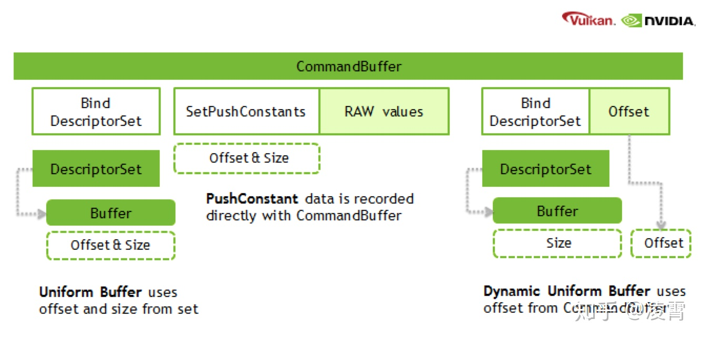

- [内存管理：Heap，Buffer，Image](#内存管理heapbufferimage)
  - [1. Vulkan 内存 分类](#1-vulkan-内存-分类)
  - [2. Heap，对象](#2-heap对象)
  - [3. Vulkan 的 Buffer 类型](#3-vulkan-的-buffer-类型)
  - [4. Image 用途](#4-image-用途)
  - [5. UniformBuffer](#5-uniformbuffer)
  - [6. Sampler](#6-sampler)
  - [7. Image & Texture](#7-image--texture)
  - [8. Push Constant](#8-push-constant)
  - [9. 参考](#9-参考)
  - [参考](#参考)

# 内存管理：Heap，Buffer，Image

## 1. Vulkan 内存 分类

||CPU: Host|GPU: Device|
|--|--|--|
|Host Local Memory|✔️|❌|
|Device Local Memory|❌|✔️|
|Host Local Device Memory|管理|可访问|
|Device Local Host Memory|可访问|管理|

* 用于 每帧 频繁 往GPU传输 的 数据，比如：顶点数据
	+ Device Local Host Memory
* 用于 写回 CPU 的 数据，比如：截屏
	+ Host Local Device Memory

## 2. Heap，对象

* 对象：Image，Buffer 等
* Heap：管理 内存
	+ 创建对象并不会分配内存，需要对 堆内存做一次 关联；
* 可以通过 物理设备 取到当前的DeviceHeap的大小信息；

## 3. Vulkan 的 Buffer 类型

* vertex buffer
* index buffer
* uniform buffer
* indirect buffer
* uniform texel buffer
* storage texel buffer
* storage buffer

* transfer src，image可以作为一个transfer命令的src
* transfer dst, image可以作为一个transfer的dst

## 4. Image 用途

TODO: 几种 类型的区别 ？

## 5. UniformBuffer

## 6. Sampler

## 7. Image & Texture

## 8. Push Constant

可能是 OpenGL 对应的Uniform，推送常量是存储在CommandBuffer中的uniform值，可以被shader直接访问到，这有点像是一个单独的全局uniform buffer。他们提供足够的空间来容纳一些矩阵或者索引值，以及原始数据的一些插值信息，这些都是根据shader的需要来使用的。

TODO： 有人说，正确性 待查

Vulkan 的 Push Constant 与 D3D12 RootSignature 的 Constant Root Parameters 机制很类似，但实际上却存在硬件限制，Vulkan 官方要求实现最小支持 128 个字节，但由于 Android 平台碎片化，Push Constant 最大值参差不齐，绝大部分是 128，也有部分 256，在目前性能最强的 Adreno 650 上也是 128，所以对于少量的 Constant 可以用这个机制，比 Update Buffer 然后再 Bind DS 性能上要好些。

## 9. 参考

* [自下而上反思Shader的执行机制](https://zhuanlan.zhihu.com/p/111577281)
* [从Vulkan API看Shader的数据绑定机制](https://zhuanlan.zhihu.com/p/111882744)
* [Vulkan中的heap/memory/buffer/image对象](https://zhuanlan.zhihu.com/p/25771079)
* sampled，image可以被采样
* storage，image可以作为一个storage image被shader使用
* transfer src，image可以作为一个transfer命令的src
* transfer dst, image可以作为一个transfer的dst
* color attachment，image可以作为RT或者resolved attachment
* depth/stencil attachment，image可以作为一个DSV
* transient attachment，临时的attachment，必须从lazily-allocated memroy分出来，可以作为一个performance hint
* input attachment，image可以作为framebuffer中的input attachment

## 参考

* [Vulkan 内存管理](https://zhuanlan.zhihu.com/p/166387973)
* [Vulkan中的heap/memory/buffer/image对象](https://zhuanlan.zhihu.com/p/25771079)