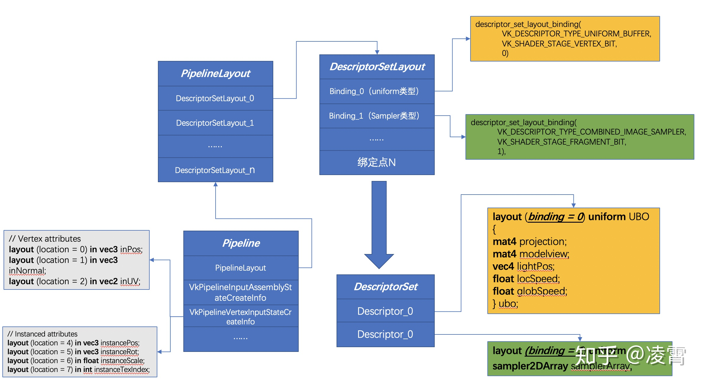
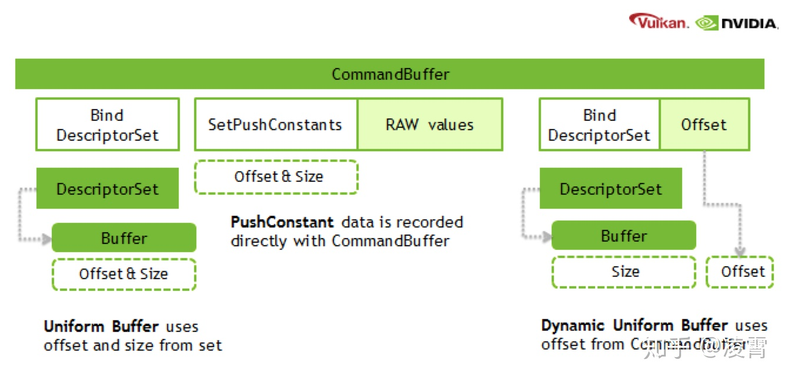

- [DescriptorSet](#descriptorset)
  - [1. UniformBuffer](#1-uniformbuffer)
  - [2. Sampler](#2-sampler)
  - [3. Image & Texture](#3-image--texture)
  - [4. Push Constant](#4-push-constant)
  - [5. 参考](#5-参考)

# DescriptorSet

## 1. UniformBuffer

## 2. Sampler

## 3. Image & Texture

## 4. Push Constant

可能是 OpenGL 对应的Uniform，推送常量是存储在CommandBuffer中的uniform值，可以被shader直接访问到，这有点像是一个单独的全局uniform buffer。他们提供足够的空间来容纳一些矩阵或者索引值，以及原始数据的一些插值信息，这些都是根据shader的需要来使用的。

TODO： 有人说，正确性 待查

Vulkan 的 Push Constant 与 D3D12 RootSignature 的 Constant Root Parameters 机制很类似，但实际上却存在硬件限制，Vulkan 官方要求实现最小支持 128 个字节，但由于 Android 平台碎片化，Push Constant 最大值参差不齐，绝大部分是 128，也有部分 256，在目前性能最强的 Adreno 650 上也是 128，所以对于少量的 Constant 可以用这个机制，比 Update Buffer 然后再 Bind DS 性能上要好些。

## 5. 参考

* [自下而上反思Shader的执行机制](https://zhuanlan.zhihu.com/p/111577281)
* [从Vulkan API看Shader的数据绑定机制](https://zhuanlan.zhihu.com/p/111882744)
* [Vulkan中的heap/memory/buffer/image对象](https://zhuanlan.zhihu.com/p/25771079)