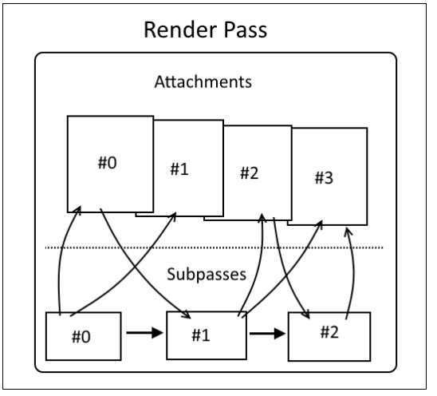
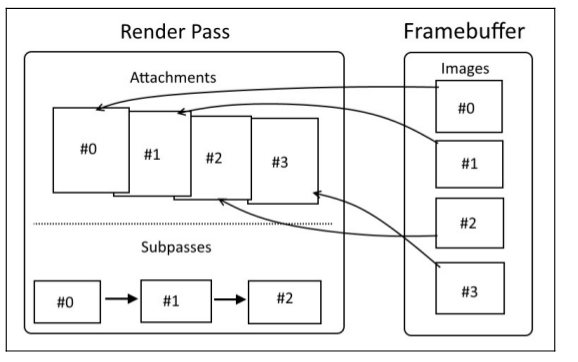
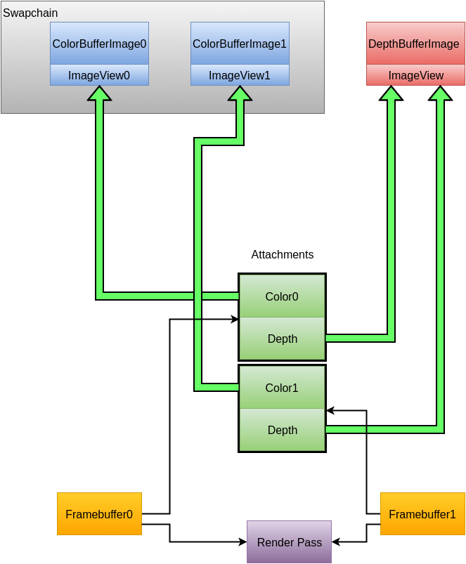

- [RenderPass & Framebuffer](#renderpass--framebuffer)
  - [1. RenderPass & SubPass](#1-renderpass--subpass)
  - [2. FrameBuffer](#2-framebuffer)
  - [3. 和 SwapChain 关系](#3-和-swapchain-关系)
  - [4. 引用](#4-引用)

# RenderPass & Framebuffer

## 1. RenderPass & SubPass

* RenderPass 是 SubPass 的集合，管理 SubPass之间的依赖
* SubPass 描述：如何使用 颜色缓冲区；
	+ 输出：当渲染目标
	+ 输入：当每次DrawCall的纹理使用；

## 2. FrameBuffer

描述：Swapchain 和 颜色缓冲区 如何 对应起来；

## 3. 和 SwapChain 关系

* ImageView
	+ 来自：SwapChain的Image
	+ 来自：DepthBufferImage
	+ 来自：某个纹理对应的Image
* FrameBuffer --> Attachment: {Color, Depth}[]
	+ 描述每个 Attachment 绑定哪个 ImageView
* TODO：RenderPass
	+ 描述：每个 Attachment 在 这一次渲染 的作用；

## 4. 引用

* [Vulkan编程指南：render & present](https://zhuanlan.zhihu.com/p/166423581)