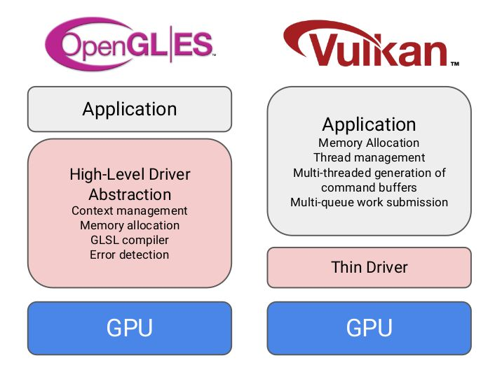

- [Vulkan](#vulkan)
  - [0. 索引](#0-索引)
  - [1. 概念](#1-概念)
  - [2. 概念图](#2-概念图)
  - [3. 功能表](#3-功能表)
  - [4. WebGL/OpenGL 程序员 视角下的 Vulkan模型](#4-webglopengl-程序员-视角下的-vulkan模型)
    - [4.1. Vulkan 适用场景](#41-vulkan-适用场景)
    - [4.2. 驱动层](#42-驱动层)
    - [4.3. 编程模型](#43-编程模型)
    - [4.4. 多线程](#44-多线程)

# Vulkan

## 0. 索引

+ [编程模型](./01_introduce.md)
+ [三缓冲](./02_tribuffer.md)
+ [交换链](./03_swap.md)
+ [一帧](./04_frame.md)
+ [命令缓冲区](./05_cmd.md)
+ [同步](./06_sync.md)
+ [管线](./07_pipeline.md)
+ [内存管理](./08_memory.md)
+ [描述符集](./09_desc_set.md)
+ [RenderPass](./10_render_pass.md)

## 1. 概念

+ Host：生产者；CPU
+ Device：消费者；GPU

## 2. 概念图

## 3. 功能表

## 4. WebGL/OpenGL 程序员 视角下的 Vulkan模型

现代图形 API Vulkan / DX12 / Metal 的特点：

* API：明确 的 语义；
* 极致：薄驱动，高吞吐，高并发，高迟延；

### 4.1. Vulkan 适用场景

* 瓶颈在CPU中和图形渲染的部分，而且该部分相对容易并行；
* 充分利用：某个计算资源相对有限的平台性能；
* 执着 减少 程序 延迟和卡顿，因为Vulkan的驱动相对gl来说比较薄；

### 4.2. 驱动层

### 4.3. 编程模型

分类：资源 & 指令

* 资源：渲染 需要的数据，通过Device直接 创建，更新，删除
    + Image（Texture），Sampler
    + 各种Buffer：Vertex Buffer, Index Buffer，Uniform Buffer，etc.
    + Pipeline，Shader
* 渲染指令，需要送到命令缓冲区，提交给Device
    + 基本就是：绑定-绑定-绑定-渲

### 4.4. 多线程

**OpenGL/DX9年代：**

**现代图形API**

* 每线程一个Cmmand Buffer Pool，每线程创建自己的Command Buffer
	+ 甚至可以每个线程录制大场景的一个部分 ！
* 都扔给一个线程进行提交

