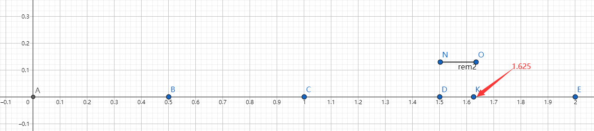
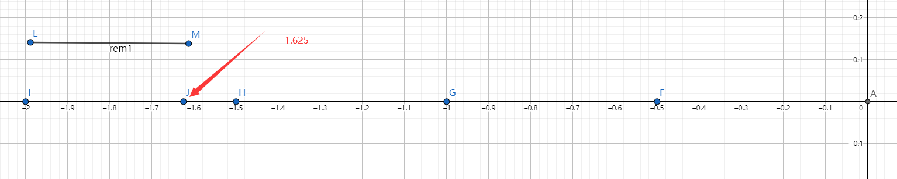

- [欧几里得 -- 带余除法](#欧几里得----带余除法)
	- [|q| 和 r：数学模型](#q-和-r数学模型)
			- [例子：假设 n = 0.5；](#例子假设-n--05)

# 欧几里得 -- 带余除法

对 整数 和 浮点数 都成立；

* 术语：`商` let q = m.div_euclid(n);
	+ 一定是 整数；
	+ 正负号 由 m*n 的 符号决定
* 术语：`非负余数` let r = m.rem_euclid(n);
	+ 一定是 非负数；
	+ 不一定 是 整数；如果n是整数，r就是整数；
* 恒等式：`m 永远等于： n * q + r`;

## |q| 和 r：数学模型

+ 用 n 将 数轴 分成 若干个 左闭右开 区间
	+ 区间索引 = 起点等于多少个n；
+ |q| = m落在哪个区间，返回该区间的索引；
+ r = m - 所在区间的起点；

#### 例子：假设 n = 0.5；

将数轴按0.5分成若干段：

* 第 0 段：AB = [0, 0.5)
* 第 1 段：BC = [0.5, 1.0)
* 第 2 段：BD = [1.0, 1.5)
* 第 3 段：DE = [1.5, 2.0)

数一数：点 K = 1.625 落在 第3段 DE
* q = 1.625.div_euclide(0.5) = 3；
* r = 1.625.rem_euclide(0.5) = 1.625 - 1.5 = 0.125



* 第 -4 段：IH = [-2.0, -1.5)
* 第 -3 段：HG = [-1.5, -1.0)
* 第 -2 段：GF = [-1.0, 0.5)
* 第 -1 段：FA = [-0.5, 0)

数一数：点 J = -1.625 落在 第-4段 IH

* q = -1.625.div_euclide(0.5) = -4；
* r = -1.625.rem_euclide(0.5) = -1.625 - (-2) = 0.375



``` rs
// #[test]
fn test_euclid() {

    let a: f32 = -1.625;
    let b = 0.5;
    // 输出：a = -1.625, b = 0.5, a / b = -4, a % b = 0.375
    println!("a = {}, b = {}, a / b = {}, a % b = {}", a, b, a.div_euclid(b), a.rem_euclid(b));
}
```