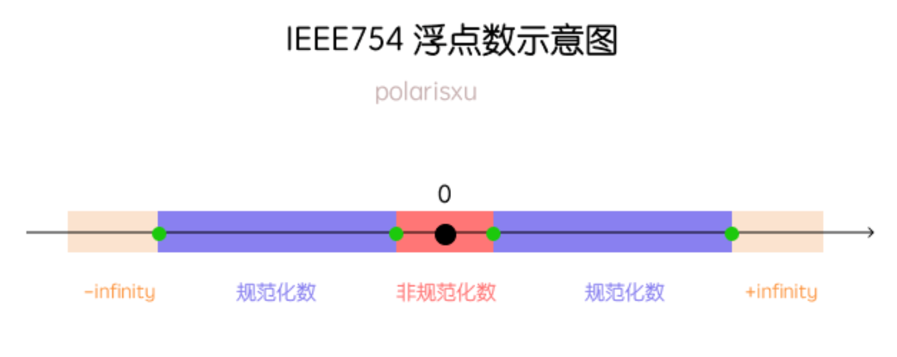
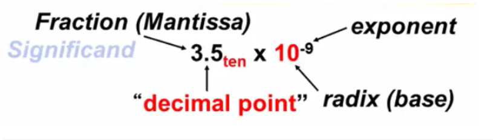
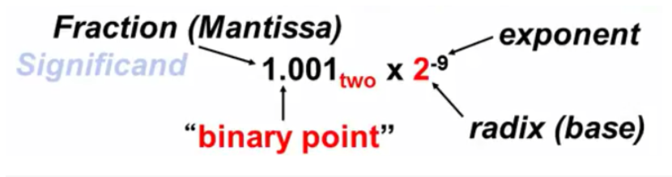
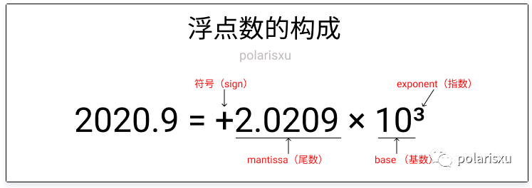
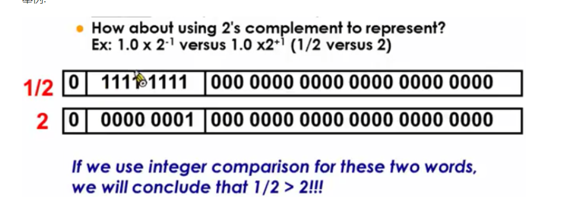
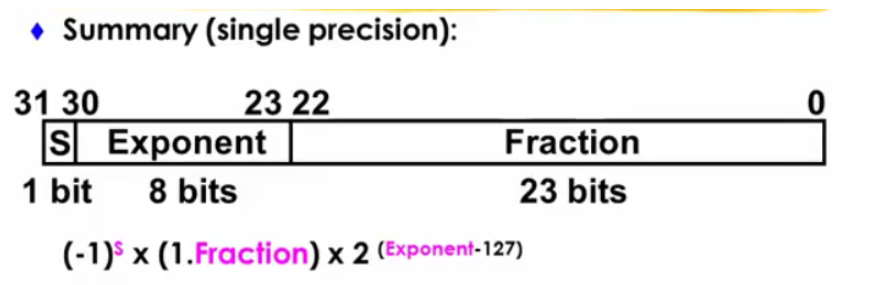
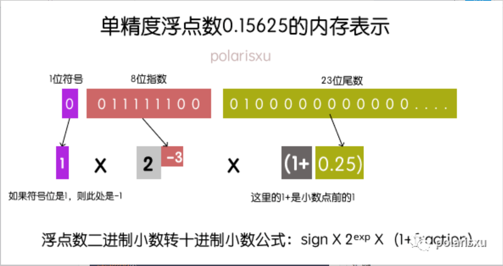

- [浮点数 float-point number](#浮点数-float-point-number)
  - [结论：IEEE-754 中，32位 float 能 `无误差` 表示的最大整数 和 最大 0.1位小数 分别是多少？](#结论ieee-754-中32位-float-能-无误差-表示的最大整数-和-最大-01位小数-分别是多少)
    - [以2的冥，为窗口区间](#以2的冥为窗口区间)
  - [（科学计数法）表示：以 f32 为例](#科学计数法表示以-f32-为例)
      - [注：尾数一定是 1. 开头；](#注尾数一定是-1-开头)
      - [尾数](#尾数)
      - [指数：移位码，实际指数 = 二进制 - 127](#指数移位码实际指数--二进制---127)
      - [编码：更多的例子](#编码更多的例子)
      - [解码](#解码)

# 浮点数 float-point number

## 结论：IEEE-754 中，32位 float 能 `无误差` 表示的最大整数 和 最大 0.1位小数 分别是多少？



### 以2的冥，为窗口区间

* 范围 = 最大值 - 最小值
	+ 想一想：为什么？
* 精度 ULP = 2^实际指数 * 2 ^ (-23 - 1)
	+ 想一想：为什么 是 -23
	+ 想一想：为什么 还要 -1

|区间|范围|精度|
|--|--|--|
|...|...|...|...|...|
|[ 2^-1, 2^0 )|0.5|2^(-1 - 24)|
|[ 2^0, 2^1 )|1|2^(0 - 24)|
|[ 2^1, 2^2 )|2|2^(1 - 24)|
|[ 2^2, 2^3 )|4|2^(2 - 24)|
|[ 2^3, 2^4 )|8|2^(4 - 24)|
|...|...|...|...|...|
|[ 2^23, 2^24 )|2^23|2^(23 - 24) = -1|

所以，f32，如果想表达精度为 1，最大整数是：2^24 - 1 = 16777216 - 1

验证 程序 如下：

``` js

// js 代码

(function() {
    // 验证 32位 能表示的 最大整数 是 (2^24 - 1)
    let arr = [];
    for (let i = 2**24 - 5; i < 2**24; ++i) {
        arr.push(i);
    }
    console.log("精度为1：值互不相同 Float32Array: ", new Float32Array(arr));

    let arr2 = [];
    for (let i = 2**24; i < 5 + 2**24; ++i) {
        arr2.push(i);
    }
    console.log("精度为1：有些值一样 Float32Array: ", new Float32Array(arr2));
})();

```

f32，如果想表达精度为 0.1，最大整数是：2^（24 - 4) = 1048576，所以 1048575.9 以前都能准确识别；这里需要 减4的意思是：要用4个二进制小数位才能区分 0.1的 精度，因为1位是0.5，2位是0.25，3位是0.125，4位表示的精度才能小于0.1

验证 程序 如下：

``` js

// js 代码

(function() {
    // 验证 32位 能表示的 最大一位小数 是 2**20 + 0.9
    let arr = [];
    let num = 2**20;
    for (let i = num; i < 1 + num ; i += 0.1) {
        arr.push(i);
    }
    console.log("精度为0.1：值互不相同 Float32Array: ", new Float32Array(arr));

    let arr2 = [];
    let num2 = 1 + 2**20;
    for (let i = num; i < 1 + num ; i += 0.1) {
        arr2.push(i);
    }
    console.log("精度为0.1：有些值一样 Float32Array: ", new Float32Array(arr2));
})();

```

## （科学计数法）表示：以 f32 为例
类比十进制：



IEEE-754标准 --- 二进制的 "科学计数法"：

#### 注：尾数一定是 1. 开头；





#### 尾数

IEEE规定，通过移位将小数点前面的值固定为1；

例子：0.15625 = 二进制 0.00101 = 二进制 1.01 * 2^-3，尾数部分就放：.01的二进制，就是 001

#### 指数：移位码，实际指数 = 二进制 - 127

127怎么来的，f32的指数位是 e = 8 位，IEEE又规定，编码正中间表示0，所以f32表示0的指数编码就是：2^(e - 1) - 1 = 2^7 - 1 = 127; 就是说：127的指数编码，表示实际指数0；

编码 = 实际指数 + 127 = -3 + 127 = 124 = 0b01111100

#### 编码：更多的例子

* 0.5 = (-1)^`0` * 1.`0` * 2^(`126` - 127)
* 2.0 = (-1)^`0` * 1.`0` * 2^(`128` - 127)



#### 解码



下图中：

* 指数：二进制表示 0b01111100 = 124，实际指数值：124 - 127 = -3
* 尾数：1 + 0.尾数表示 = 1 + 二进制 0.01 = 1 + 0.25 = 1.25
* 表示小数：(-1)^0 * 1.25 * 2^-3 = 0.15625

