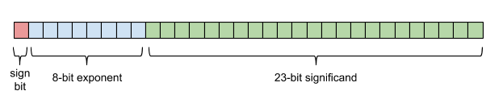

- [浮点误差：以 f32 为例](#浮点误差以-f32-为例)
  - [衡量单位：ULP（Unit in the last place）](#衡量单位ulpunit-in-the-last-place)

# 浮点误差：以 f32 为例



假设 有库 为f32 提供 了下面 3个接口（`swift`直接内置在语言中）：

``` rs
// 取sign位：1表示负数，0表示正数
fn f32::sign(self) -> i32;

// 取exponent值：二进制表示 - 127
fn f32::exponent(self) -> i32;

// 取尾数值，（对规范小数：+ 1.0）
fn f32::significand(self) -> f32;
```

例子：

``` rs

let value = 0.15625f32; // 1/8 + 1/32

value.sign()          // 0
value.exponent()      // 124 - 127 = -3
value.significand()   // 1.0 + 0.25 = 1.25
```

## 衡量单位：[ULP](https://www.codenong.com/cs106993967/)（Unit in the last place）

假设：ulp是f32的一个方法；

``` rs
// 返回值e 是 f 表示的最小精度
// 换句话：f + e 是 大于f 的 最小f32值
fn f32::ulp(self) -> f32;
```

`基准常量：ulpOfOne` = 1.0对应的ulp = f32::EPSILON = 2^-23 = 1.1920929E-7f32

ulp函数的实现：`ulp(f) = ulpOfOne * 2 ^ exponent(f)`