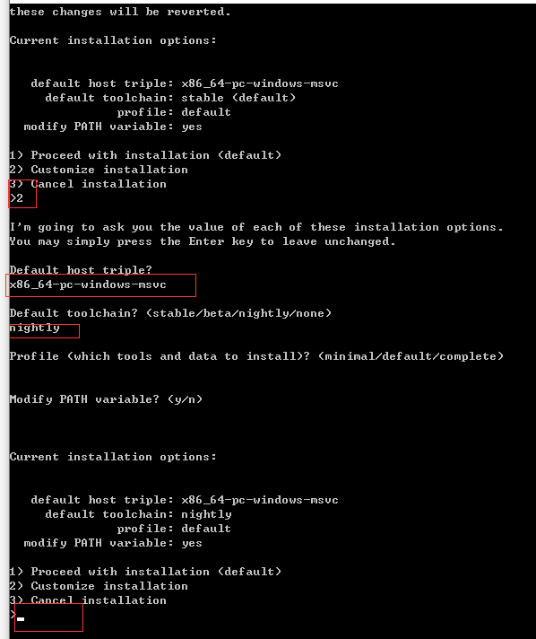
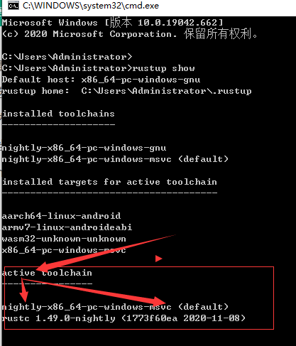

# Rust 安装

[到这里下载：rustup-init 64位](https://www.rust-lang.org/zh-CN/tools/install)

安装步骤如图，注意 红色的部分：

* 2
* x86_64-pc-windows-msvc
	+ x86-64的意思是，选择64位cpu架构的指令集（构建你的程序）；
	+ windows选择msvc，linux选择gnu；
* nightly
* profile 默认 直接回车
* PATH 默认 直接回车
* 回到选项，直接回车

## 如何知道安装是否成功

命令行：输入 rustshow，打印出现 如下关键字：msvc，nightly

