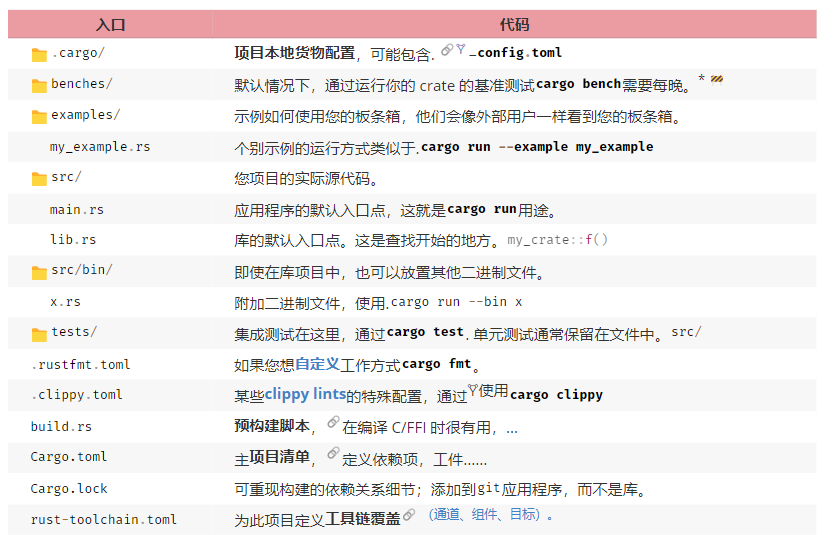
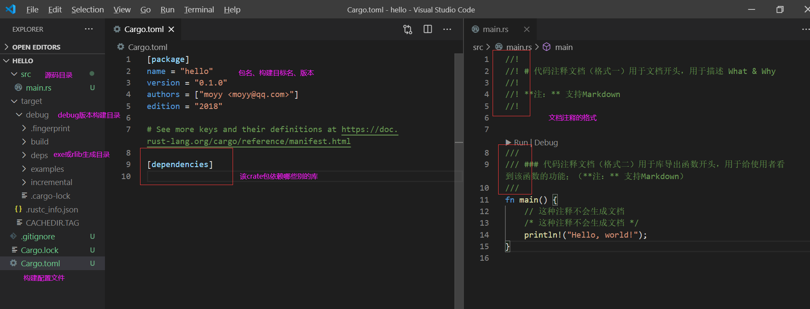

- [helo-world](#helo-world)
  - [1. 项目 目录结构](#1-项目-目录结构)
  - [2. 代码 & 注释](#2-代码--注释)
  - [3. Cargo初步](#3-cargo初步)
  - [4. 示例](#4-示例)

# helo-world

控制台中，用命令行输入

+ cargo new hello
+ cd hello
+ cargo run

能在控制台看到 “Hello, World！” 就算成功；

+ 构建(默认debug）：cargo build
+ 构建 release：cargo build --release

## 1. 项目 目录结构



## 2. 代码 & 注释



## 3. Cargo初步

+ [Cargo 101](https://doc.rust-lang.org/book/ch01-03-hello-cargo.html)

## 4. 示例

假设有个需要到处给别的crate看到的模块：test.rs 要这么写

``` rs

//! # 这种注释会在文档生成，叫做模块注释
//! 简要说明模块层面的 What和 Why
//! 可以写模块的一个简单的Demo
//! 可以使用任何markdown标签

#![feature(test)]
extern crate test;

/// 这种注释用于说明模块的导出接口
pub struct A {
	/// 这种注释是文档注释，用于说明导出公有属性的作用
	/// 作用于下一行
	pub c: i32,

	a: i32, // 这种注释外部看不到，通常用于说明实现细节
	b: i32, /* 这种注释同实现细节 */
}

impl A {
	/// 在这里描述下方法test怎么使用的
	/// Rust惯例不需要单独描述每个参数和返回值的意义；
	/// 这里可以写任何Markdown格式的说明，包括例子
	// 在这里描述下这个函数的实现细节，不会导出到文档
	pub fn add(&self, a: i32, b: i32) -> f32 {
		1.0f32
	}

	// 这个函数是私有的，没必要用文档注释
	fn private_add(&self) {
	}
}

// 这里是针对该模块的 单 元 测 试
#[test]
fn add_test_1() {
	// 可以加很多断言
	assert!(0.0f.is_nan());
}

// 这里是针对该模块的 性 能 测 试
// 性能测试用的是Release版本的，可以放心；
#[bench]
fn add_test_bench(bencher: &mut Bencher) {
	// 这里执行初始化

	bencher.iter(|| {
		// 这里测试性能，要求 多次执行，效果 幂等
		let mut sum = 0.0f32;
		for i in 0..=65535u16 {
			sum += ...
		}
		// 注：这里需要返回一个和中间计算过程关联的一个值，否则整个闭包有可能被优化掉
		sum
	});

	// 这里执行释放函数
}

```