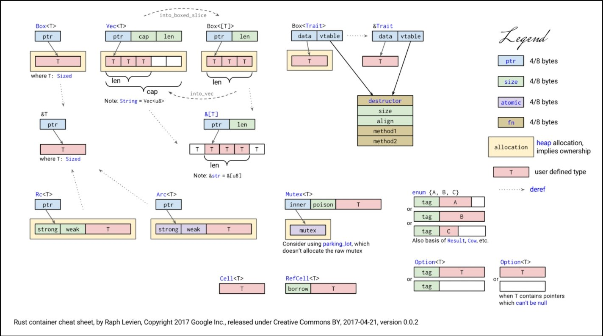

- [std库：内存布局](#std库内存布局)
  - [1. 符号 说明](#1-符号-说明)
  - [2. 看图说话：拿 Vec< T > 做例子说明](#2-看图说话拿-vec-t--做例子说明)
  - [3. 看图说话，到底能到什么程度？](#3-看图说话到底能到什么程度)

# std库：内存布局

## 1. 符号 说明

虚线箭头代表解引用操作

看右边

* 4/8 bytes，说明这种颜色的大小，根据CPU指令集来决定
	+ 例子：X86-32位指令集是4字节，X64-64位指令集是8字节；
	+ 目前我们项目统统使用64位指令集
		- Android手机因为要使用第三方库，可能例外；
* ptr：说明装的是指针，它的值 是 另一端内存的地址
* size：说明类型是 usize；
* [atomic](https://doc.rust-lang.org/std/sync/atomic/)，说明 它是原子类型，一条原子代表 完整执行的-不可被中断的 CPU指令；
* fn 说明这是一个函数指针；
* allocation 说明`黄色`的代表数据 一 定 在 堆 上 分配，**隐藏着该类型掌控了数据的所有权**；
	+ `注意：`没有allocation颜色的代表不一定在堆上分配；
	+ `注意：`一 定 在 堆 上 分配 的 逆命题是：可能不在堆上分配，并不是一定在栈上分配
	+ 因为有可能T本身也是堆上的数据；

## 2. 看图说话：拿 Vec< T > 做例子说明

从上图可知，Vec< T > 是个结构体，在x64下，3 * 8 = 24字节；

该结构体 有三个字段：

* ptr：类型是指针，指向一段 堆上的 由 类型T 的 连续数据 组成；
* cap：类型是usize，图中所示是5，应该代表 vec 的 容量（最大可用元素的个数）
* len：类型是usize，图中所示是3，应该代表 vec 的 长度（目前已用的元素的个数）

所谓 String，其实就是 T = u8 的 Vec，Vec< u8 >

另外，Box<[T]> 通过 Vec< T >的into_boxed_slice方法得到，而且内存是经过重新调整的（隐藏可能的性能开销，因为Box<[T]>的ptr指向的堆数据有`黄色`包围，隐藏着Box<[T]>有着那段数据的所有权）

通过 Vec< T > 解引用，得到：切片 &[T]，所谓的切片的内存布局，从图上可知：

* 有ptr和len组成
* 所有的 切片 结构体 在x64平台上都是8*2=16字节大小；
* 切片 没有 握住所有权；指向的是数据的引用，所以需要考虑：生命周期 & 跨await的调用；

最后：所谓的 &str，布局跟 &[u8] 一样；

## 3. 看图说话，到底能到什么程度？

图上可知，RefCell< T >，之所以能知道borrow或borrow_mut的时候崩溃，是因为除了数据T之外，还多了usize的borrow变量标记当前是否被别人借过；

图上可知，Arc < T > 和 Rc < T > 的区别在于：强引用计数strong 和 弱引用计数weak，在Arc是原子操作，同样的加1，原子操作做的事情要复杂一些，所以耗时会慢一些；

图上可知，enum 枚举的长度 = usize长度 + 所有字段中 最大的那个长度，而且具体的enum变量是可以根据tag知道是属于哪个类型的；

图上可知，Option长度 是可以被优化的，只要编译器知道T不可能为空的时候，前面的tag会被编译器去掉；

图上可知，所谓的TraitObject，实际上是个 data指针 + 虚表指针；虚表放的是：析构函数（drop） + 大小 + 对齐字节数 + 定义trait时的方法对应的实现；
> C++程序员注意：这个和C++的虚函数的实现机制不一样，和Windows当年的MFC消息派发机制类似，具体要参考网上的说明；