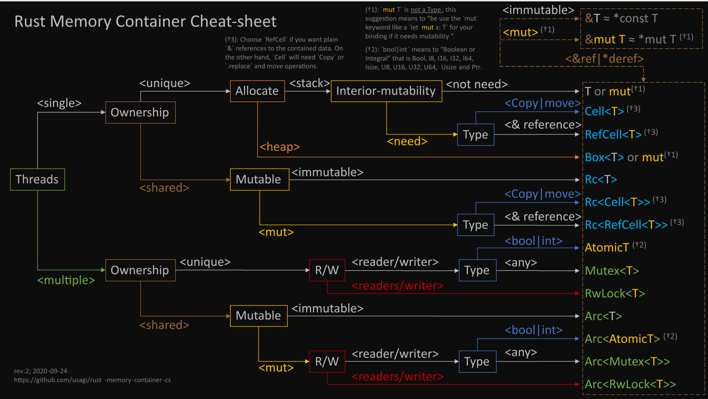

# 按场景 选择 数据类型

## 详细说明

假设你现在有个数据T（基本类型 | Struct | Enum），怎么包装在Rust类型中：

### 单线程

#### 独占模式

+ 堆 分配  --> Box< T >
+ 栈 分配
	- 不需要 内部可变性 --> T or mut T
	- 需要 内部可变性
		* 拷贝语义 | 移动语义 --> Cell< T >
		* 引用语义           --> RefCell< T >

#### 和别的变量 共享，这时T本身一定是在堆上；

- 不可变 --> Rc< T >
- 可变
	* 拷贝语义 | 移动语义 --> Rc< Cell< T > >
	* 引用语义           --> Rc< RefCell< T > >

### 多线程

#### 独占模式

* 单读 / 单写
	+ T是int或bool --> Atomic
	+ 互斥锁：Mutex< T >
* 多读 / 单写 --> 读写锁 RwLock< T >

#### 和别的变量 共享，多加一层Arc即可

* 不可变 --> Arc< T >
* 单读 / 单写
	+ T是int或bool --> Arc< Atomic >
	+ Arc< Mutex< T > >
* 多读 / 单写 --> Arc< RwLock< T > >