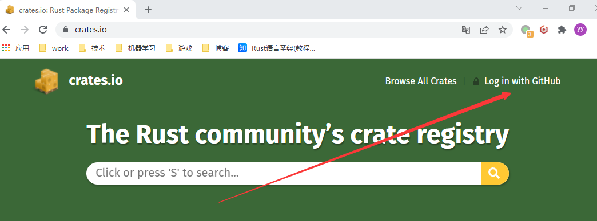
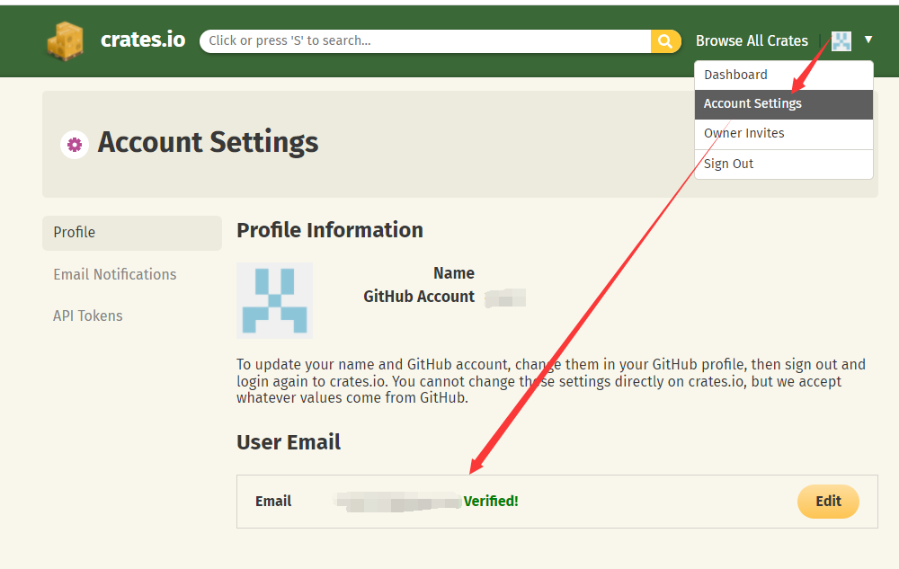
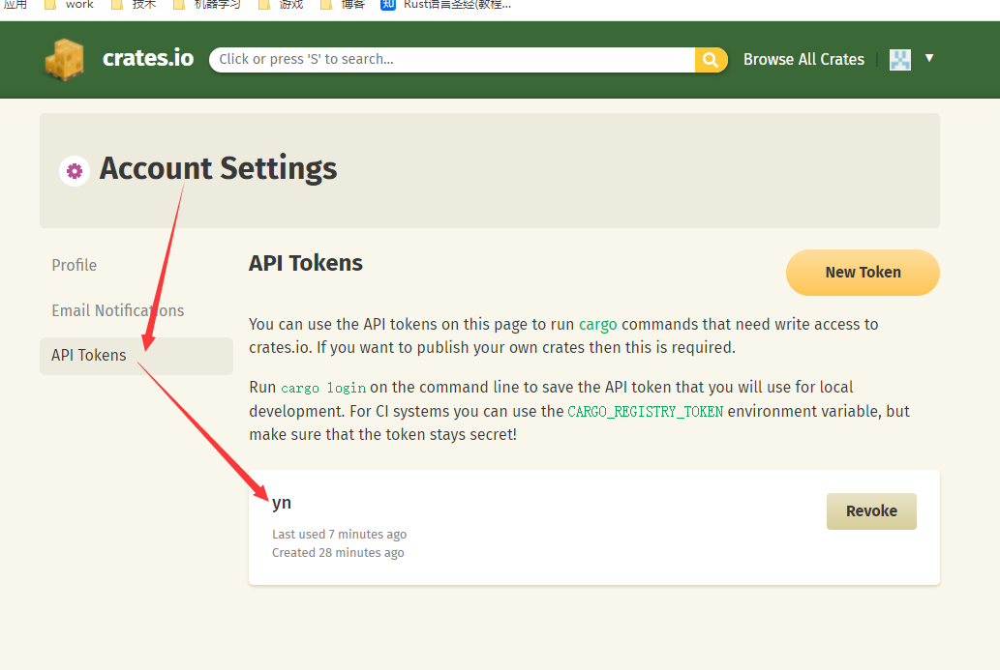
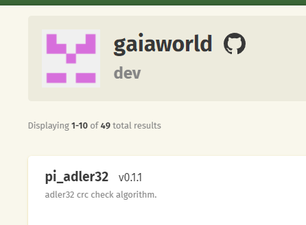
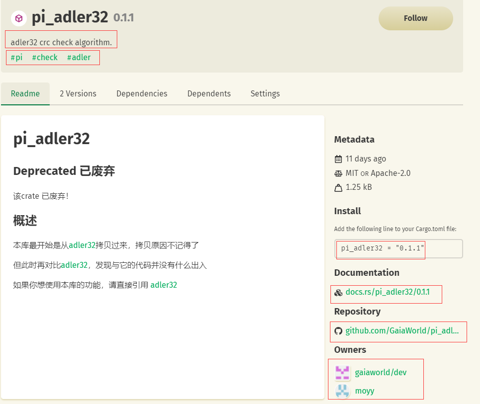
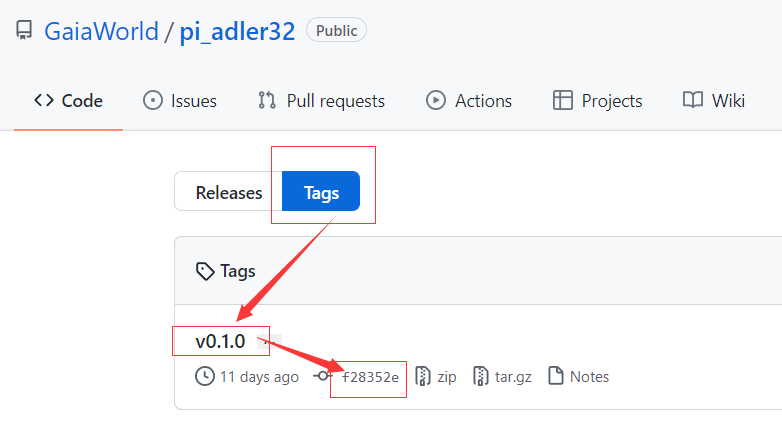

- [发布 crates.io](#发布-cratesio)
  - [1. 准备工作 【每部电脑 仅需做一次】](#1-准备工作-每部电脑-仅需做一次)
    - [1.1. 生成 Cargo token](#11-生成-cargo-token)
      - [1.1.1. 用 Github:GaiaWorld 对应的 个人账号 登录 crates.io](#111-用-githubgaiaworld-对应的-个人账号-登录-cratesio)
      - [1.1.2. 到设置页面，输入 邮箱，一定要 通过 邮箱验证](#112-到设置页面输入-邮箱一定要-通过-邮箱验证)
      - [1.1.3. 统一输入 `yn`，生成 api-token，得到 token字符串](#113-统一输入-yn生成-api-token得到-token字符串)
    - [1.2. 命令行 登录 cargo](#12-命令行-登录-cargo)
    - [1.3. 为 git 私钥文件 路径](#13-为-git-私钥文件-路径)
    - [1.4. 安装 cargo release](#14-安装-cargo-release)
  - [2. 项目配置，新建 rust项目时，需要做一次](#2-项目配置新建-rust项目时需要做一次)
    - [2.1. Cargo.toml 配置](#21-cargotoml-配置)
    - [2.2. 添加 README.md](#22-添加-readmemd)
  - [3. 发布项目，每次升级版本时，进行一次](#3-发布项目每次升级版本时进行一次)
    - [3.1. 升级 Cargo.toml 的 版本](#31-升级-cargotoml-的-版本)
    - [3.2. 提交一次, 注释统一如下 【拷贝时，请 忽略 ` 的这两行】](#32-提交一次-注释统一如下-拷贝时请-忽略--的这两行)
    - [3.3. 脚本](#33-脚本)
      - [3.3.1. 先 运行 cargo release](#331-先-运行-cargo-release)
      - [3.3.2. 上面 绿色 通过后，再 运行带 execute 选项的 cargo release](#332-上面-绿色-通过后再-运行带-execute-选项的-cargo-release)
    - [3.4. 【仅 推送 0.1.0 之后 做一次】 为 cargo 添加 GaiaWorld 的 开发组](#34-仅-推送-010-之后-做一次-为-cargo-添加-gaiaworld-的-开发组)
  - [4. 另外注意事项](#4-另外注意事项)
  - [5. 效果](#5-效果)
    - [5.1 crates.io中GaiaWorld分组](#51-cratesio中gaiaworld分组)
    - [5.2. crates.io中pi_adler32 首页](#52-cratesio中pi_adler32-首页)
    - [5.3. Github:GaiaWorld 对应 pi_adler32](#53-githubgaiaworld-对应-pi_adler32)

# 发布 [crates.io](https://crates.io/)

## 1. 准备工作 【每部电脑 仅需做一次】

### 1.1. 生成 Cargo token

#### 1.1.1. 用 Github:GaiaWorld 对应的 个人账号 登录 crates.io



#### 1.1.2. 到设置页面，输入 邮箱，一定要 通过 邮箱验证



#### 1.1.3. 统一输入 `yn`，生成 api-token，得到 token字符串



###  1.2. 命令行 登录 cargo

``` bat
cargo login 上面生成的token字符串
```

### 1.3. 为 git 私钥文件 路径

目的：git 命令需要 密钥，非小乌龟；比如：cargo release

+ 注1：下面的 路径：必须 用 /，而且 **不能** 有 空格 或 中文
+ 注2：该私钥文件 和 `ppk`文件 **不一样**，要从 `ppk` 转换生成，[如何生成，点这里](/docs/process/process-1dmplvt377s83)

``` bat
@ 注：路径：必须 用 /，而且不能有空格或中文

git config core.sshCommand 'ssh -i D:/moyy/ppk/moyy'

```

**注3：** 如果 git config core.sshCommand 报错

如果命令出错，要检查 git 必须在 2.20 及其以上！

``` bat
git --version
```

还是不行的话，可以 添加 下面的环境变量 到 系统去

+ 名 GIT_SSH_COMMAND
+ 值 ssh -i D:/moyy/ppk/moyy，注：必须 用 /，而且不能有空格或中文

### 1.4. 安装 cargo release

``` bat
cargo install cargo-release
```

作用：就是 rust 版本的 standard-version

+ 生成 更新日志 需要 另外的工具配合，调研中
+ 从 cargo.toml 拿版本出来，打 tag
+ 推 github
+ 推 crates.io

## 2. 项目配置，新建 rust项目时，需要做一次

### 2.1. Cargo.toml 配置

+ 每次修改完 Cargo.toml 一定要 提交 并上推到 GaiaWorld 上
+ 必填项：`名称`，`版本`，`作者`，`描述`，`github仓库`，`许可证`，`关键字`（要有 pi）

例子：

``` toml

[package]
# 包名
name = "请修改：包名"
# 发布版本
version = "0.1.0"
# 作者，可以写 n个；但一个库 只有一个主要维护者
authors = ["请修改：作者名 moyy <请修改：邮箱地址 moyy@gmail.com>"]
# rust 编译器版本，一般写 2021
edition = "2021"
# 库 作用 描述，一句话概括
description = "请修改：描述信息."
# 仓库对应的 源码地址
repository = "https://github.com/GaiaWorld/请修改：仓库名"
# 开源许可，一般用 双许可
license = "MIT OR Apache-2.0"
# 在 crates.io 搜索的 关键字
keywords = ["pi", "请修改：搜索关键字"]

[dependencies]

```

### 2.2. 添加 README.md

将 lib.rs 的 文档注释 拷贝到上面去

## 3. 发布项目，每次升级版本时，进行一次

### 3.1. 升级 Cargo.toml 的 版本

### 3.2. 提交一次, 注释统一如下 【拷贝时，请 忽略 ` 的这两行】

``` txt
chore: 修改 Cargo 版本
```

### 3.3. 脚本

#### 3.3.1. 先 运行 cargo release

测试：本地 是否能构建，是否能推到 github；

``` bat
cargo release
```

#### 3.3.2. 上面 绿色 通过后，再 运行带 execute 选项的 cargo release

正式打tag，并将tag推到 github，同时推 crates.io

``` bat
cargo release --execute
```

### 3.4. 【仅 推送 0.1.0 之后 做一次】 为 cargo 添加 GaiaWorld 的 开发组

以便于 [在这里](https://crates.io/teams/github:gaiaworld:dev) 统一管理 pi 项目

``` bat
cargo owner --add github:所在组
```

## 4. 另外注意事项

+ 如果 是 纯粹的 rust 库，请在 `.gitignore`中 填上 `Cargo.lock`，**不** 提 交 此 文 件
+ 凡是构建成: `so`, `dll`, `exe`, `apk`, `ipa`, `wasm` 的 rust项目，统一提交 `Cargo.lock`，以便于项目出错跟踪；

## 5. 效果

### 5.1 crates.io中GaiaWorld分组

[crates.io中GaiaWorld分组](https://crates.io/teams/github:gaiaworld:dev)



### 5.2. crates.io中pi_adler32 首页

[crates.io中pi_adler32 首页](https://crates.io/crates/pi_adler32)



### 5.3. Github:GaiaWorld 对应 pi_adler32

[Github:GaiaWorld 对应 pi_adler32](https://github.com/GaiaWorld/pi_adler32)

这样能将 发布版本 和 git的某次提交 对应起来

