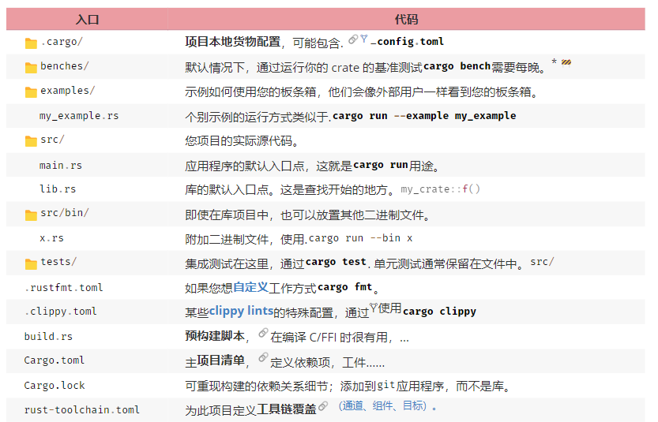

# Rust 工程

+ [VSCode 当 IDE](../tool/01_vscode.md)
+ [Rust 项目 目录结构](https://cheats.rs/#project-anatomy)

## 1. 索引

+ [rustup](./01_rustup.md)
+ [注释 & 文档](./02_comment.md)
+ [全局变量 & 动态库](./03_global.md)
+ [Cargo](./04_cargo/README.md)
+ [惯用法](./05_idiomatic/README.md)
+ [crates.io](./06_crates_io/README.md)

