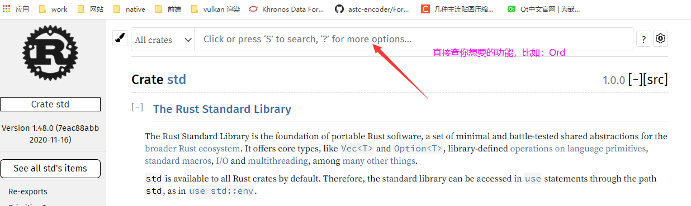
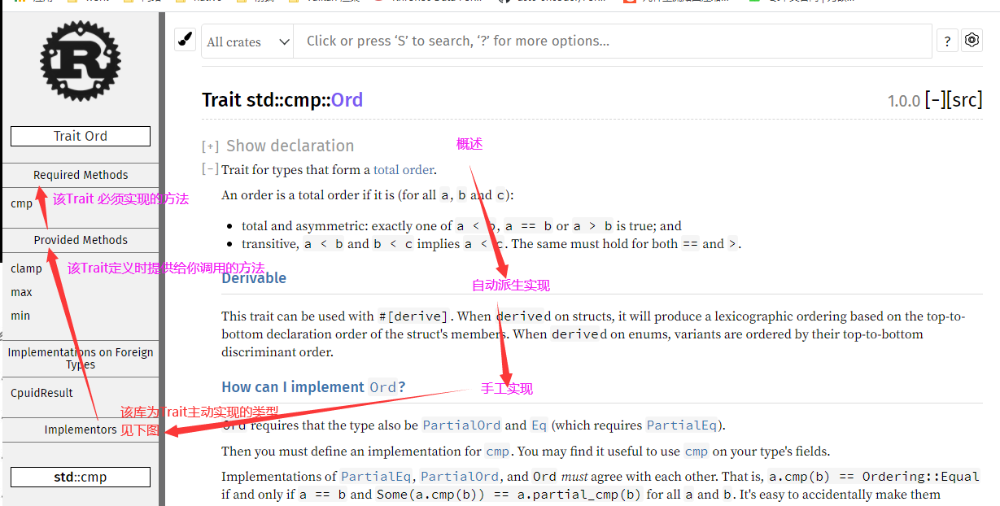
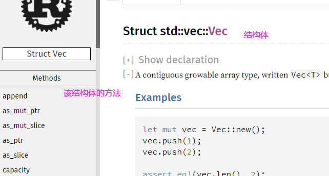
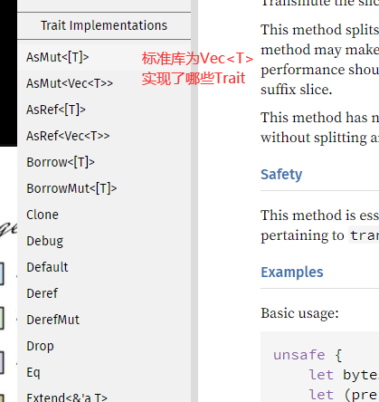
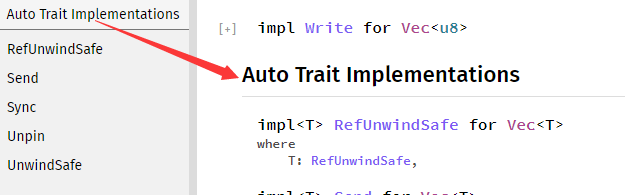
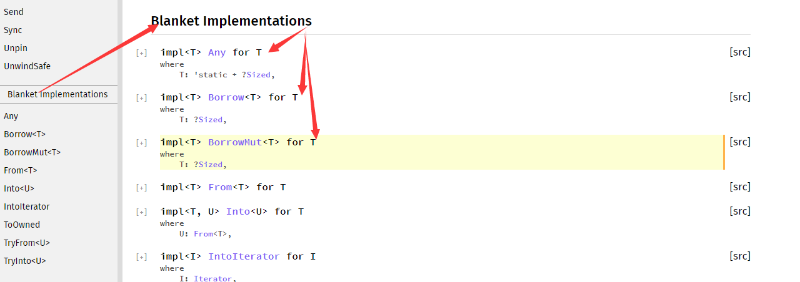

# [Rust std文档](https://doc.rust-lang.org/std/)

本文试图说明 Rust 标准库文档 的结构，以便于新人快速上手

## Trait类型

左边导航栏：

* Required Methods 实现该Trait的时候，必须要实现的方法；
* Provided Methods Trait定义的时候已经提供实现的方法；

右边文档：注意下Derived章节，有些Trait可以通过 [#derived]派生，不需要自己实现；

## Struct | Enum 类型

左边导航栏：

* Methods 该结构实现的方法；
* Trait Implemetations 该结构为哪些Trait提供了实现；
* Auto Trait Implementations 编译器自动为Vec< T > 实现的Trait
* Blanket Implementations 别的地方实现的Trait中的 T 也包含了：Vec
	+ 具体概念 见：[Trait: 定义共享的行为](https://kaisery.github.io/trpl-zh-cn/ch10-02-traits.html#%E5%AE%9A%E4%B9%89-trait)

