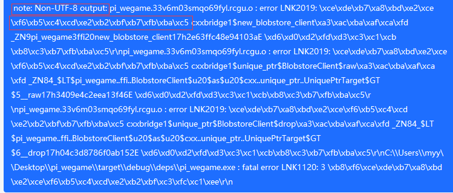
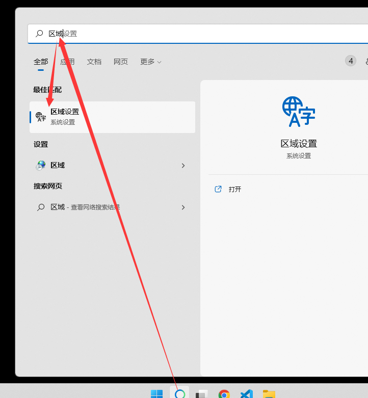
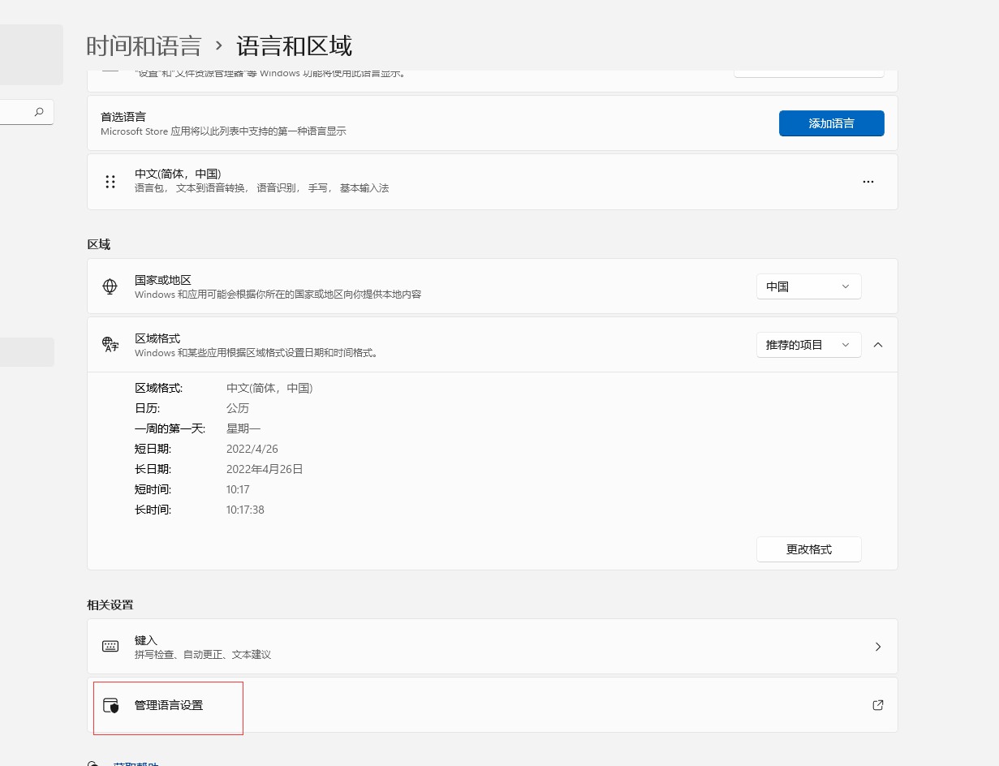
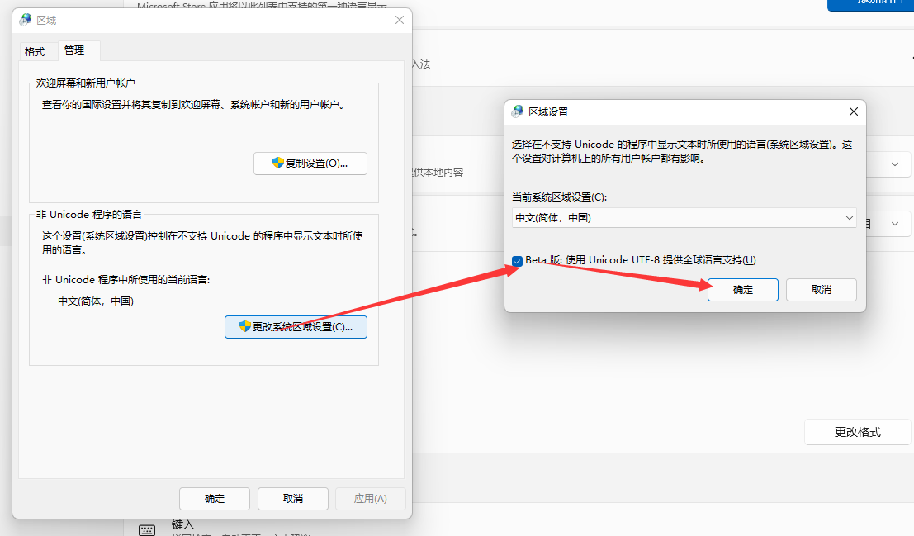
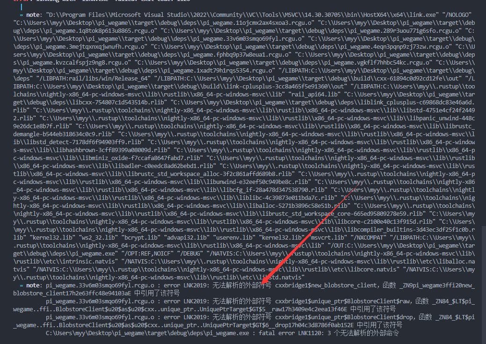

- [Bindgen: C/C++ 变 Rust](#bindgen-cc-变-rust)
  - [1. 前提](#1-前提)
  - [2. build.rs](#2-buildrs)
    - [2.1. 库依赖](#21-库依赖)
    - [2.2. 头文件](#22-头文件)
    - [2.3. 构建C++的过程中，报 链接错误 `Non-UTF-8 output`](#23-构建c的过程中报-链接错误-non-utf-8-output)
    - [2.4. 解决](#24-解决)
    - [2.5. 效果](#25-效果)

# Bindgen: C/C++ 变 Rust

[Bindgen: C/C++ 变 Rust](https://github.com/rust-lang/rust-bindgen)

## 1. 前提

安装 LLVM，将其中的bin目录加入 环境变量

以作者的安装目录为例

下面是 Windows/cmd 命令行的配置

``` bat
set LIBCLANG_PATH="D:\Program Files\LLVM\bin"
```

下面是 Windows/PowerShell 命令行的配置

``` ps1
$env:LIBCLANG_PATH="D:\Program Files\LLVM\bin"
```

## 2. build.rs

### 2.1. 库依赖

下面打印到控制台，目的是 搜索 C++ 的 lib/a

``` rust

// 需要链接的库，一个库一个 【dll 对应的是 lib，so 对应的是 a】
// 去掉 文件名的 lib前缀，去掉 so后缀
println!("cargo:rustc-link-lib=rail_api64");

// 指定到哪个目录搜索库
// 一个目录一行
println!("cargo:rustc-link-search=rail/libs/win/Release_64");
```

### 2.2. 头文件

所有的头文件，需要 include 到 wrapper.h / wrapper.hpp 中

+ .h 告诉 clang，是编 C代码
+ .hpp 告诉 clang，是编 C++ 代码【已经尝试了，加选项 -X C++ 无效】

``` rs
    let bindings = bindgen::Builder::default()
		// 注意这个
    	.header("wrapper.hpp")
        .parse_callbacks(Box::new(bindgen::CargoCallbacks))
        .generate()
        .expect("Unable to generate bindings");
```

### 2.3. 构建C++的过程中，报 链接错误 `Non-UTF-8 output`

类似 这种



### 2.4. 解决

Windows 10 及其以上，可以用 UTF8作为 整个系统的 输入，跟 Rust一样，但目前还是处于 Beta 版本







### 2.5. 效果

