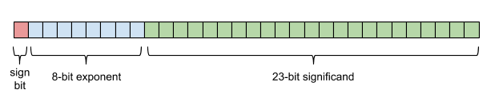
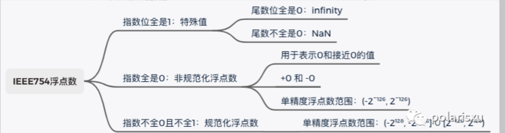

- [IEEE-754 浮点数 标准](#ieee-754-浮点数-标准)
  - [分类](#分类)
  - [分类](#分类-1)
  - [总结](#总结)
  - [参考](#参考)

# IEEE-754 浮点数 标准

**注：** Rust中，如果要用`f16`：[第三方库 -- half](https://crates.io/crates/half)

||名称|符号位|指数位|尾数位|
|--|--|--|--|--|
|[f16](https://zh.wikipedia.org/wiki/%E5%8D%8A%E7%B2%BE%E5%BA%A6%E6%B5%AE%E7%82%B9%E6%95%B0)|half 半精度|1|5|10|
|f32|single 单精度|1|8|23|
|f64|double 双精度|1|11|52|

## 分类

任何 f32 都归于下面5类之一：

+ NaN分：静默NaN或QNaN和信令NaN或SNaN。安静的NaN在有效位数上有一个前导，并通过表达式传播。它们表示一个不确定的值，例如除以无穷大或将无穷大乘以零的结果。信号NaN的有效位数前导零。它们用于无效的操作，以表示浮点硬件异常。

|||s-符号位|e-指数位|m-尾数位|说明|
|--|--|--|--|--|--|
|0|零|0或1|全是0|全是0|正0 和 负0|
|SubNormal|次规范小数|0或1|全是0|非 全是0|解码时，尾数默认是：0.尾数编码|
|infinity|∞|0或1|全是1|全是0|正∞ 和 负∞|
|NaN|Not a Number|0或1|全是1|非 全是0|分 SNaN 和 QNan|
|Normal|规范小数|0或1|非全是0 && 非是全1|任意|解码时，尾数默认是：1.尾数编码|

## 分类

* 零-0：正0 = 负0 = 0
* 无穷-Ininity，+Infity，-Infinity
* NaN：Not a Number
	+ 特点：NaN != NaN
	+ 有：quiet-NaN 和 signaling-NaN 之分
* 规范化小数：Normal Float
* 次规范化小数：SubNormal Float

## 总结

## 参考

* [15 张图带你深入理解浮点数](https://cloud.tencent.com/developer/article/1729530)
* [计算机科学家需要知道的浮点数算术](https://docs.oracle.com/cd/E19957-01/806-3568/ncg_goldberg.html)