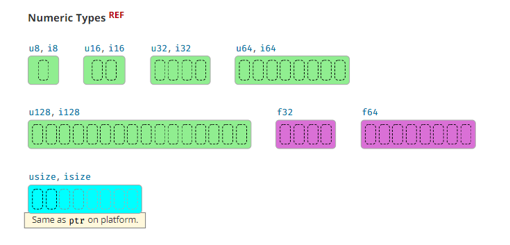

- [std::i32](#stdi32)
  - [1. 参考](#1-参考)
  - [2. 常量](#2-常量)
  - [3. 函数：有符号类型特有的 （i8/i16/i32/i64/i128/isize）](#3-函数有符号类型特有的-i8i16i32i64i128isize)
  - [4. 二的冥，无符号类型 特有的 （u8/u16/u32/u64/u128/usize)](#4-二的冥无符号类型-特有的-u8u16u32u64u128usize)
  - [5. 从 str --> i32](#5-从-str----i32)
  - [6. 比较大小](#6-比较大小)
  - [7. 字节 运算](#7-字节-运算)
  - [8. bit 信息](#8-bit-信息)
  - [9. 序列化 & 反序列化](#9-序列化--反序列化)
    - [9.1 i32 --> [u8]](#91-i32----u8)
    - [9.2 [u8] --> i32](#92-u8----i32)
  - [10. 数学 运算表](#10-数学-运算表)
    - [10.1 左移 和 右移 的 overflow](#101-左移-和-右移-的-overflow)
    - [10.2 默认 运算符 & 默认函数](#102-默认-运算符--默认函数)
    - [10.3 Rust 对 内置数学运算：](#103-rust-对-内置数学运算)

# [std::i32](https://doc.rust-lang.org/std/primitive.i32.html)

## 1. 参考

+ [整数 的 概念](../../integer/README.md)



不同于C语言有 <math.h>，rust的 运算 和 类型 是放在一起的；

## 2. 常量

| 常量                                                                                  | 作用                     | 例子                                         |
| ------------------------------------------------------------------------------------- | ------------------------ | -------------------------------------------- |
| [i32::MIN](https://doc.rust-lang.org/std/primitive.i32.html#associatedconstant.MIN)   | 该类型能表示的最小数     | 有符号是 -2^bits; 无符号是 0                 |
| [i32::MAX](https://doc.rust-lang.org/std/primitive.i32.html#associatedconstant.MAX)   | 该类型能表示的最大数     | 有符号是 2^(bits-1) - 1; 无符号是 2^bits - 1 |
| [i32::BITS](https://doc.rust-lang.org/std/primitive.i32.html#associatedconstant.BITS) | 该类型能表示的二进制位数 | 对i32，是32；对isize/usize，看CPU架构        |

## 3. 函数：有符号类型特有的 （i8/i16/i32/i64/i128/isize）

| 函数                                                                                    | 作用                                    |
| --------------------------------------------------------------------------------------- | --------------------------------------- |
| [i32::abs](https://doc.rust-lang.org/std/primitive.i32.html#method.abs)                 | 绝对值                                  |
| [i32::signum](https://doc.rust-lang.org/std/primitive.i32.html#method.signum)           | 符号函数：正数返回1，负数返回-1，0返回0 |
| [i32::is_positive](https://doc.rust-lang.org/std/primitive.i32.html#method.is_positive) | 是否正数                                |
| [i32::is_negative](https://doc.rust-lang.org/std/primitive.i32.html#method.is_negative) | 是否负数                                |

## 4. 二的冥，无符号类型 特有的 （u8/u16/u32/u64/u128/usize)

| 函数                                                                                                                  | 作用                        |
| --------------------------------------------------------------------------------------------------------------------- | --------------------------- |
| [u32::is_power_of_two](https://doc.rust-lang.org/std/primitive.u32.html#method.is_power_of_two)                       | 是否2的冥                   |
| [u32::next_power_of_two](https://doc.rust-lang.org/std/primitive.u32.html#method.next_power_of_two)                   | 不小于参数的2的冥，溢出崩溃 |
| [u32::wrapping_next_power_of_two](https://doc.rust-lang.org/std/primitive.u32.html#method.wrapping_next_power_of_two) |                             |
| [u32::checked_next_power_of_two](https://doc.rust-lang.org/std/primitive.u32.html#method.checked_next_power_of_two)   |                             |

## 5. 从 str --> i32

| 函数                                                                                          | 作用                                |
| --------------------------------------------------------------------------------------------- | ----------------------------------- |
| [i32::from_str_radix](https://doc.rust-lang.org/std/primitive.i32.html#method.from_str_radix) | 从str变i32，从 2进制 到 36进制 均可 |

## 6. 比较大小

| 函数                                                                                | 作用 |
| ----------------------------------------------------------------------------------- | ---- |
| [i32::max_value](https://doc.rust-lang.org/std/primitive.i32.html#method.max_value) |      |
| [i32::min_value](https://doc.rust-lang.org/std/primitive.i32.html#method.min_value) |      |

## 7. 字节 运算

| 函数                                                                                      | 作用                      | 例子               |
| ----------------------------------------------------------------------------------------- | ------------------------- | ------------------ |
| [i32::swap_bytes](https://doc.rust-lang.org/std/primitive.i32.html#method.swap_bytes)     | 按字节反转数字            |
| [i32::reverse_bits](https://doc.rust-lang.org/std/primitive.i32.html#method.reverse_bits) | 按bit位反转数字           |
| [i32::rotate_left](https://doc.rust-lang.org/std/primitive.i32.html#method.rotate_left)   | 左旋转，和左移不同        | 0x10000000 --> 0x1 |
| [i32::rotate_right](https://doc.rust-lang.org/std/primitive.i32.html#method.rotate_right) | 按bit右轮旋转，和右移不同 | 0x1 --> 0x10000000 |

## 8. bit 信息

| 函数                                                                                          | 作用                                                          |
| --------------------------------------------------------------------------------------------- | ------------------------------------------------------------- |
| [i32::count_zeros](https://doc.rust-lang.org/std/primitive.i32.html#method.count_zeros)       | 二进制位中，含0的数量                                         |
| [i32::count_ones](https://doc.rust-lang.org/std/primitive.i32.html#method.count_ones)         | 二进制位中，含1的数量                                         |
| [i32::leading_zeros](https://doc.rust-lang.org/std/primitive.i32.html#method.leading_zeros)   | 返回左起第一个1-bit之前0的个数，同gcc内置函数 __builtin_clz   |
| [i32::leading_ones](https://doc.rust-lang.org/std/primitive.i32.html#method.leading_ones)     | 返回左起第一个0-bit之前1的个数                                |
| [i32::trailing_zeros](https://doc.rust-lang.org/std/primitive.i32.html#method.trailing_zeros) | 返回右起第一个1-bit之后的0的个数，同gcc内置函数 __builtin_ctz |
| [i32::trailing_ones](https://doc.rust-lang.org/std/primitive.i32.html#method.trailing_ones)   | 返回右起第一个0-bit之后的1的个数                              |

## 9. 序列化 & 反序列化

`注：` 对大小端不了解的，见最后说明

Rust代码，判断 目标机器上的大小端：

``` rs
cfg!(target_endian = "big") // "little"
```

### 9.1 i32 --> [u8]

| 函数                                                                                    | 作用       |
| --------------------------------------------------------------------------------------- | ---------- |
| [i32::as_ne_bytes](https://doc.rust-lang.org/std/primitive.i32.html#method.as_ne_bytes) | 本机字节序 |
| [i32::to_be](https://doc.rust-lang.org/std/primitive.i32.html#method.to_be)             | 大端       |
| [i32::to_be_bytes](https://doc.rust-lang.org/std/primitive.i32.html#method.to_be_bytes) | 大端       |
| [i32::to_le](https://doc.rust-lang.org/std/primitive.i32.html#method.to_le)             | 小端       |
| [i32::to_le_bytes](https://doc.rust-lang.org/std/primitive.i32.html#method.to_le_bytes) | 小段       |
| [i32::to_ne_bytes](https://doc.rust-lang.org/std/primitive.i32.html#method.to_ne_bytes) | 本机字节序 |

### 9.2 [u8] --> i32

| 函数                                                                                        | 作用       |
| ------------------------------------------------------------------------------------------- | ---------- |
| [i32::from_be](https://doc.rust-lang.org/std/primitive.i32.html#method.from_be)             | 大端       |
| [i32::from_be_bytes](https://doc.rust-lang.org/std/primitive.i32.html#method.from_be_bytes) | 大端       |
| [i32::from_le](https://doc.rust-lang.org/std/primitive.i32.html#method.from_le)             | 小端       |
| [i32::from_le_bytes](https://doc.rust-lang.org/std/primitive.i32.html#method.from_le_bytes) | 小端       |
| [i32::from_ne_bytes](https://doc.rust-lang.org/std/primitive.i32.html#method.from_ne_bytes) | 本机字节序 |

## 10. 数学 运算表

`注：` 对 右移、商和余数 不了解的，见最后说明

### 10.1 左移 和 右移 的 overflow

位数参数的值 不能超过 符号表示的数字；

* 比如：u8，位数不能超过8；
* 比如：i32，位数不能超过32；

### 10.2 默认 运算符 & 默认函数

除了运算符，还有几个默认的函数：

| 函数                                                                             | 作用                          |
| -------------------------------------------------------------------------------- | ----------------------------- |
| [pow](https://doc.rust-lang.org/std/primitive.i32.html#method.pow)               | overflow时会panic             |
| [div_euclid](https://doc.rust-lang.org/std/primitive.i32.html#method.div_euclid) | overflow 或 除数为0时 会panic |
| [rem_euclid](https://doc.rust-lang.org/std/primitive.i32.html#method.rem_euclid) | overflow 或 除数为0时 会panic |

### 10.3 Rust 对 内置数学运算：

- 全部使用 类似：a.checked_add(b).unwrap()的行为，在`overflow`时会`panic`
- 其他语言 均 使用 `wrapping_` 语义
- **结论：** 在`overlfow`时，行为 和 其他语言**不 一 样！**


|                                      | checked_<br><br>返回Option< i32 >                                                                | wrapping_<br><br>overflow时，环绕回去（C++语义）                                                   | overflowing_<br><br>返回值带是否overflow                                                                 | saturating_<br><br>overflow时截断                                                        | （不建议用）unchecked_<br><br>不检查overflow，结果未定义                               |
| ------------------------------------ | ------------------------------------------------------------------------------------------------ | -------------------------------------------------------------------------------------------------- | -------------------------------------------------------------------------------------------------------- | ---------------------------------------------------------------------------------------- | -------------------------------------------------------------------------------------- |
| 加<br>add                            | [checked_add](https://doc.rust-lang.org/std/primitive.i32.html#method.checked_add)               | [wrapping_add](https://doc.rust-lang.org/std/primitive.i32.html#method.wrapping_add)               | [overflowing_add](https://doc.rust-lang.org/std/primitive.i32.html#method.overflowing_add)               | [saturating_add](https://doc.rust-lang.org/std/primitive.i32.html#method.saturating_add) | [unchecked_add](https://doc.rust-lang.org/std/primitive.i32.html#method.unchecked_add) |
| 减<br>sub                            | [checked_sub](https://doc.rust-lang.org/std/primitive.i32.html#method.checked_sub)               | [wrapping_sub](https://doc.rust-lang.org/std/primitive.i32.html#method.wrapping_sub)               | [overflowing_sub](https://doc.rust-lang.org/std/primitive.i32.html#method.overflowing_sub)               | [saturating_sub](https://doc.rust-lang.org/std/primitive.i32.html#method.saturating_sub) | [unchecked_sub](https://doc.rust-lang.org/std/primitive.i32.html#method.unchecked_sub) |
| 乘<br>mul                            | [checked_mul](https://doc.rust-lang.org/std/primitive.i32.html#method.checked_mul)               | [wrapping_mul](https://doc.rust-lang.org/std/primitive.i32.html#method.wrapping_mul)               | [overflowing_mul](https://doc.rust-lang.org/std/primitive.i32.html#method.overflowing_mul)               | [saturating_mul](https://doc.rust-lang.org/std/primitive.i32.html#method.saturating_mul) | [unchecked_mul](https://doc.rust-lang.org/std/primitive.i32.html#method.unchecked_mul) |
| 冥<br>pow                            | [checked_pow](https://doc.rust-lang.org/std/primitive.i32.html#method.checked_pow)               | [wrapping_pow](https://doc.rust-lang.org/std/primitive.i32.html#method.wrapping_pow)               | [overflowing_pow](https://doc.rust-lang.org/std/primitive.i32.html#method.overflowing_pow)               | [saturating_pow](https://doc.rust-lang.org/std/primitive.i32.html#method.saturating_pow) | 无                                                                                     |
| 除<br>div                            | [checked_div](https://doc.rust-lang.org/std/primitive.i32.html#method.checked_div)               | [wrapping_div](https://doc.rust-lang.org/std/primitive.i32.html#method.wrapping_div)               | [overflowing_div](https://doc.rust-lang.org/std/primitive.i32.html#method.overflowing_div)               | 无                                                                                       | 无                                                                                     |
| 取反<br>neg                          | [checked_neg](https://doc.rust-lang.org/std/primitive.i32.html#method.checked_neg)               | [wrapping_neg](https://doc.rust-lang.org/std/primitive.i32.html#method.wrapping_neg)               | [overflowing_neg](https://doc.rust-lang.org/std/primitive.i32.html#method.overflowing_neg)               | 无                                                                                       | 无                                                                                     |
| 取余数<br>rem                        | [checked_rem](https://doc.rust-lang.org/std/primitive.i32.html#method.checked_rem)               | [wrapping_rem](https://doc.rust-lang.org/std/primitive.i32.html#method.wrapping_rem)               | [overflowing_rem](https://doc.rust-lang.org/std/primitive.i32.html#method.overflowing_rem)               | 无                                                                                       | 无                                                                                     |
| 左移<br>shl                          | [checked_shl](https://doc.rust-lang.org/std/primitive.i32.html#method.checked_shl)               | [wrapping_shl](https://doc.rust-lang.org/std/primitive.i32.html#method.wrapping_shl)               | [overflowing_shl](https://doc.rust-lang.org/std/primitive.i32.html#method.overflowing_shl)               | 无                                                                                       | 无                                                                                     |
| 右移<br>shr                          | [checked_shr](https://doc.rust-lang.org/std/primitive.i32.html#method.checked_shr)               | [wrapping_shr](https://doc.rust-lang.org/std/primitive.i32.html#method.wrapping_shr)               | [overflowing_shr](https://doc.rust-lang.org/std/primitive.i32.html#method.overflowing_shr)               | 无                                                                                       | 无                                                                                     |
| 带余除法<br>div_euclid               | [checked_div_euclid](https://doc.rust-lang.org/std/primitive.i32.html#method.checked_div_euclid) | [wrapping_div_euclid](https://doc.rust-lang.org/std/primitive.i32.html#method.wrapping_div_euclid) | [overflowing_div_euclid](https://doc.rust-lang.org/std/primitive.i32.html#method.overflowing_div_euclid) | 无                                                                                       | 无                                                                                     |
| 带余除法，最小非负余数<br>rem_euclid | [checked_rem_euclid](https://doc.rust-lang.org/std/primitive.i32.html#method.checked_rem_euclid) | [wrapping_rem_euclid](https://doc.rust-lang.org/std/primitive.i32.html#method.wrapping_rem_euclid) | [overflowing_rem_euclid](https://doc.rust-lang.org/std/primitive.i32.html#method.overflowing_rem_euclid) | 无                                                                                       | 无                                                                                     |