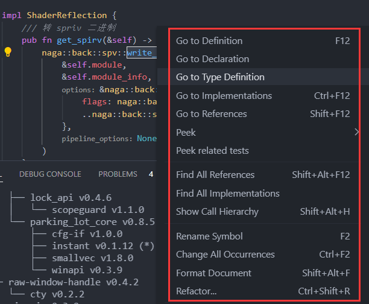
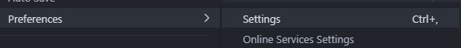

- [VSCode 当 Rust IDE](#vscode-当-rust-ide)
  - [1. Rust 相关的 VSCode 扩展](#1-rust-相关的-vscode-扩展)
  - [2. Rustup 工具链](#2-rustup-工具链)
    - [2.1. 例子 可用的：2022-03-27](#21-例子-可用的2022-03-27)
  - [3. Cargo 工具](#3-cargo-工具)
  - [4. rust-analyzer 使用](#4-rust-analyzer-使用)
  - [5. rust-analyzer 设置](#5-rust-analyzer-设置)
    - [5.1. 菜单 File --> Preferences --> Settings](#51-菜单-file----preferences----settings)
    - [5.2. 点击 User / settings.json，看 需求 添加 下面字段](#52-点击-user--settingsjson看-需求-添加-下面字段)
    - [5.3. 预期效果](#53-预期效果)

# VSCode 当 Rust IDE

## 1. Rust 相关的 VSCode 扩展

|扩展名|作用|说明|
|--|--|--|
|One Dark Pro|好看主题|程序员最常用的主题|
|rust-analyzer|rust 语法分析|自动补全、代码提示、定义跳转 等|
|CodeLLDB|运行 调试|注意：main函数上面的 Run 和 Debug|
|Error Lens|错误信息直接贴在对应的行号上||
|crates|依赖包的 最新版本提示 和 跳转||
|Better TOML|Cargo.toml 的 语法高亮||

## 2. Rustup 工具链

rust-analyzer 扩展，很多时候不能用于 最新的 nightly 版本，导致 写代码不方便；

为了 让 其更稳定，尽量使用 固定的 rustup 工具链；

参考：[这里](/docs/rust_tech/rust_tech-1cmko6j58rq94)

### 2.1. 例子 可用的：2022-03-27

+ 安装：rustup toolchain install nightly-2022-03-27
+ 切换：rustup default nightly-2022-03-27
+ 编译目标，windows上，默认是 msvc；其它请 按需 安装
	- 命令：rustup target add wasm32-unknown-unknown
	- 命令：rustup target add aarch64-linux-android
	- 命令：rustup target add armv7-linux-androideabi

## 3. Cargo 工具

|工具名|作用|安装|使用|说明|
|--|--|--|--|--|
|cargo tree|crates 依赖 树状展示|cargo install cargo-tree|cargo tree|也可以 直接 搜索 cargo.lock|

## 4. rust-analyzer 使用

[rust-analyzer](https://rust-analyzer.github.io/manual.html)

命令: Ctrl+Shift+P，输入 命令

|特性|使用|说明|
|--|--|--|
|[递归展开宏](https://rust-analyzer.github.io/manual.html#expand-macro-recursively)|命令: Expand macro recursively||
|[crates 依赖 SVG图](https://rust-analyzer.github.io/manual.html#view-crate-graph)|命令: View Crate Graph|依赖 画 SVG 图|
|[格式化字符串完成](https://rust-analyzer.github.io/manual.html#format-string-completion)|logd / "{x} + {y} = {result}".print Tab||
|[Magic 完成](https://rust-analyzer.github.io/manual.html#magic-completions)|expr.if → if expr {}||
|其他|光标移到目标符号，右键|跳转到定义，重命名 等|



## 5. rust-analyzer 设置

### 5.1. 菜单 File --> Preferences --> Settings



### 5.2. 点击 User / settings.json，看 需求 添加 下面字段

``` json
{
    "editor.mouseWheelZoom": true,
    "editor.wordWrap": "on",
    "rust-analyzer.checkOnSave.command": "clippy"
}
```

### 5.3. 预期效果

+ 自动换行
+ 鼠标 滚轮 改变 vscode 大小
+ 每次 保存，cargo clippy 检查 警告