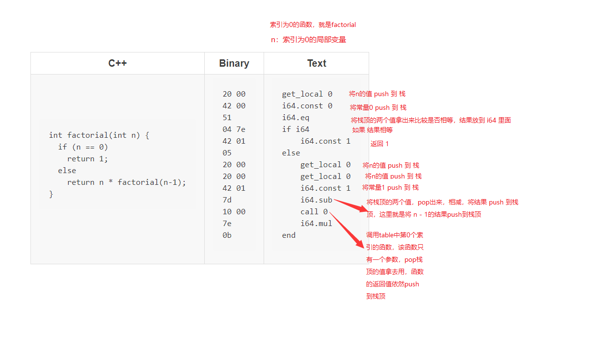
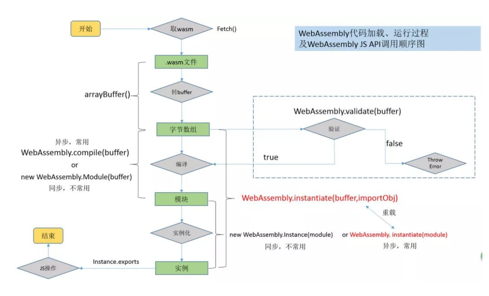
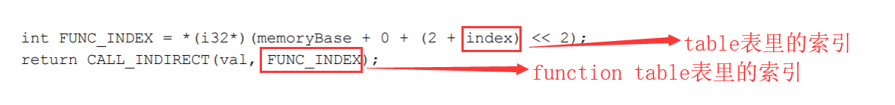
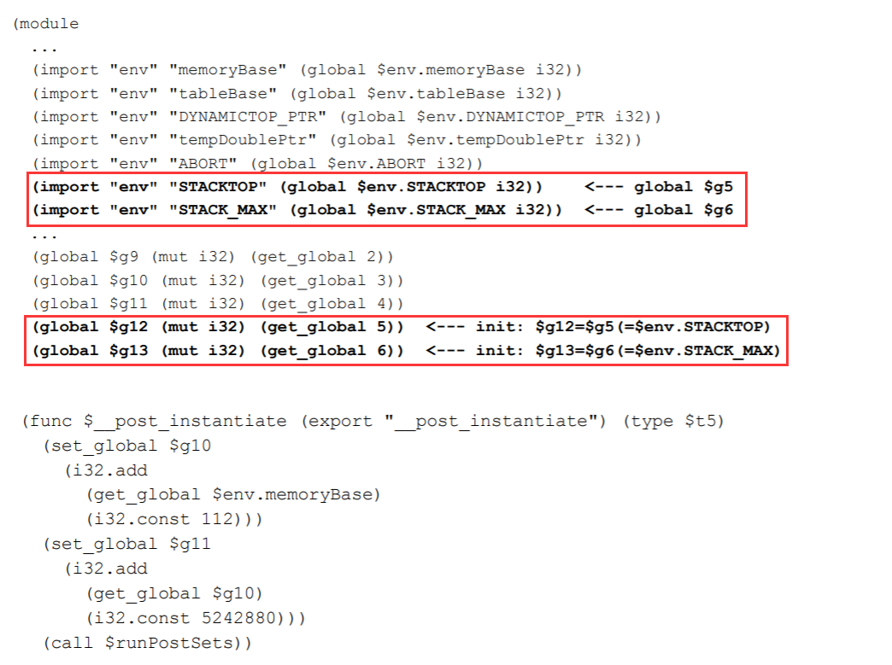

- [Wasm 入门](#wasm-入门)
	- [1. 特点](#1-特点)
	- [2. hello-world](#2-hello-world)
	- [3. JS-API](#3-js-api)
		- [3.1. 主要类型](#31-主要类型)
		- [3.2. 主要函数](#32-主要函数)
	- [4. 流程](#4-流程)
		- [4.1. Compile 时，对下面几个进行初始化](#41-compile-时对下面几个进行初始化)
		- [4.2. 初始化 Memory](#42-初始化-memory)
		- [4.3. 初始化 Table表](#43-初始化-table表)
		- [4.4. 初始化 function table](#44-初始化-function-table)
		- [4.5. instantiate 后](#45-instantiate-后)
	- [5. 完整例子](#5-完整例子)
		- [5.1. simple.wasm](#51-simplewasm)
		- [5.2. 导入对象声明：](#52-导入对象声明)
		- [5.3. js 使用](#53-js-使用)
	- [6. 项目中的wasm](#6-项目中的wasm)
	- [7. 参考](#7-参考)

# Wasm 入门

## 1. 特点

+ 基于`栈`的虚拟机

## 2. hello-world

+ get_local 0 是把索引为0的局部变量push到栈中
+ i64.const 0 是把常量0 push到栈中
+ i64.eq 是将栈顶的两个变量pop出来并作比较，将比较结果push到栈中
+ if i64 是将比较结果pop出来，如果相等则执行i64.const 1，将常量1 push到栈中
+ call 0 是调用索引为0的函数



## 3. JS-API

[JS-API](http://webassembly.org.cn/getting-started/js-api/) && [MDN--API使用](https://developer.mozilla.org/zh-CN/docs/WebAssembly/Using_the_JavaScript_API)

### 3.1. 主要类型

+ 编译 & 初始化
	- [WebAssembly.Module](https://developer.mozilla.org/zh-CN/docs/Web/JavaScript/Reference/Global_Objects/WebAssembly/Module)
	- [WebAssembly.Instance](https://developer.mozilla.org/zh-CN/docs/Web/JavaScript/Reference/Global_Objects/WebAssembly/Instance)
+ 运行时
	- [WebAssembly.Global](https://developer.mozilla.org/zh-CN/docs/Web/JavaScript/Reference/Global_Objects/WebAssembly/Global)
		* 全局变量实例, 可以被JS访问，可跨多个Module Instance共享
	- [WebAssembly.Memory](https://developer.mozilla.org/zh-CN/docs/Web/JavaScript/Reference/Global_Objects/WebAssembly/Memory)
	- 创建新的 Memory 对象，buffer指向一个ArrayBuffer
	- buffer属性，可以由JS或Wasm访问和修改；
	- [WebAssembly.Table](https://developer.mozilla.org/zh-CN/docs/Web/JavaScript/Reference/Global_Objects/WebAssembly/Table) 目前只能放供wasm调用的js函数；

### 3.2. 主要函数

+ WebAssembly.validate(buffer: Uint8Array) => bool
+ WebAssembly.compile(buffer: Uint8Array) => Promise< Module >
+ WebAssembly.instantiate(module, importObject) => Promise< Instance >
	* wasm需要用到的js函数和变量，需要在这里用 importObject = {...} 传进去；

## 4. 流程



### 4.1. Compile 时，对下面几个进行初始化

### 4.2. 初始化 Memory

* 线性内存大小为256页（每页64KB，即16MB）
将data数据段copy到索引为1024的地址处

### 4.3. 初始化 Table表

将需要间接函数调用（即通过指针调用函数）的函数指针进行初始化排序



### 4.4. 初始化 function table

*(void*)(memoryBase + OFFSET) = tableBase + INDEX(tableBase在Emscripten中一般为0)

### 4.5. instantiate 后

实例化完毕后，就可以在JS中通过exports来调用wasm中的导出函数

## 5. 完整例子

### 5.1. simple.wasm

``` wasm

(module
  (func $i (import "imports" "imported_func") (param i32))
  (func (export "exported_func")
    i32.const 42
    call $i))

```

### 5.2. 导入对象声明：

``` js

let importObject = {
    imports: {
        imported_func: arg => console.log(arg),
    }
};

```

### 5.3. js 使用

``` js

fetch('simple.wasm')
.then(res =>
  res.arrayBuffer()
).then(bytes =>
  WebAssembly.instantiate(bytes, importObject)
).then(results => {
  results.instance.exports.exported_func();
});

```

## 6. 项目中的wasm

``` js

var importObject = {
	env: {
		'memoryBase': 0,
		'tableBase': 0,
		'memory': new WebAssembly.Memory({initial: 256}),
		'table': new WebAssembly.Table({initial: 256, element: 'anyfunc'}),
		'abort': alert,
		...
	};
}

```



## 7. 参考

+ [Wasm 入门](https://ithelp.ithome.com.tw/users/20000108/ironman/1593)
+ [深入浅出 Wasm](http://reader.epubee.com/books/mobile/d4/d403824d4bba4f9ac649ac8a4e4c8f03/text00011.html)