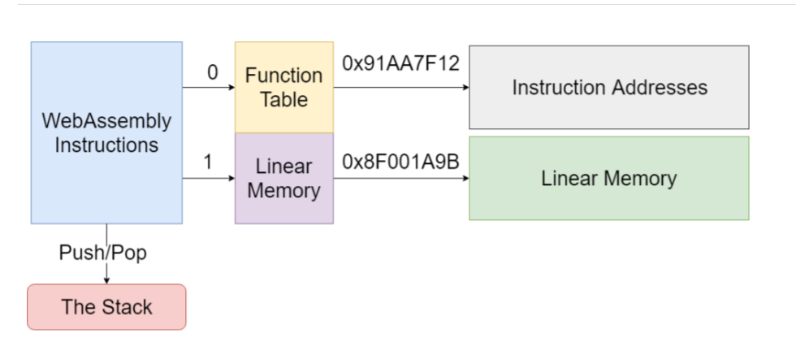

- [内存 / 函数](#内存--函数)
	- [1. 内存](#1-内存)
	- [2. Module 中 大概 section分布，供参考](#2-module-中-大概-section分布供参考)
	- [3. 函数调用](#3-函数调用)

# 内存 / 函数

## 1. 内存

* Data数据段是从0x400开始的
* Function Table表也在其中，起始地址为memoryBase（Emscripten中默认为1024，即0x400）
* 栈地址起始为STACKTOP
* 堆地址起始为STACK_MAX
* WebAssembly的`栈`是从低地址往高地址增长的

## 2. Module 中 大概 section分布，供参考

## 3. 函数调用

* WebAssembly函数地址都在WebAssembly内存之外的地址，所以是访问不到的。
* WebAssembly用了一个Function Table来引用函数，虽然其地址对于WebAssembly是不可见的，但是可以操作索引。
	+ 通过：call_indirect

